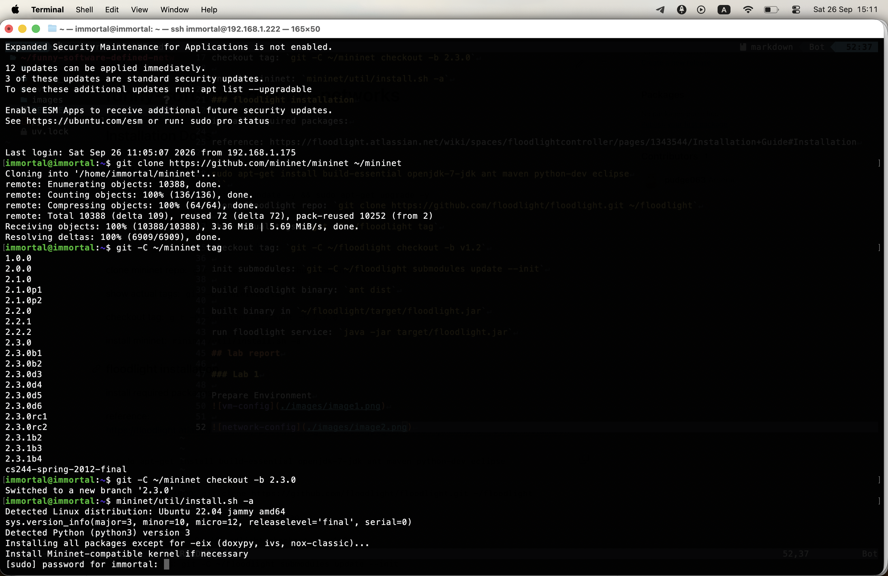
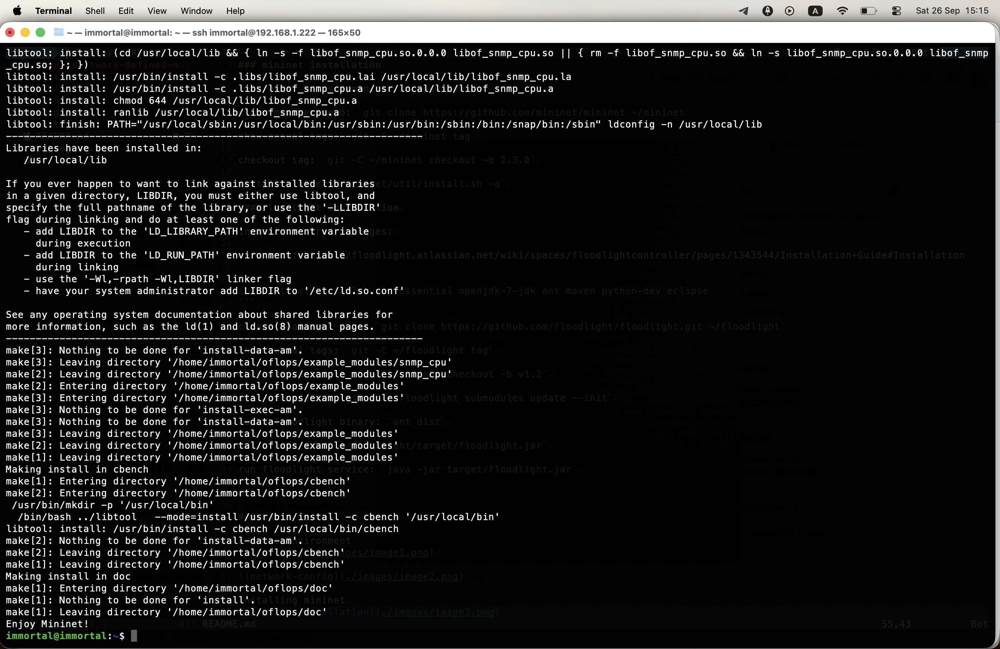
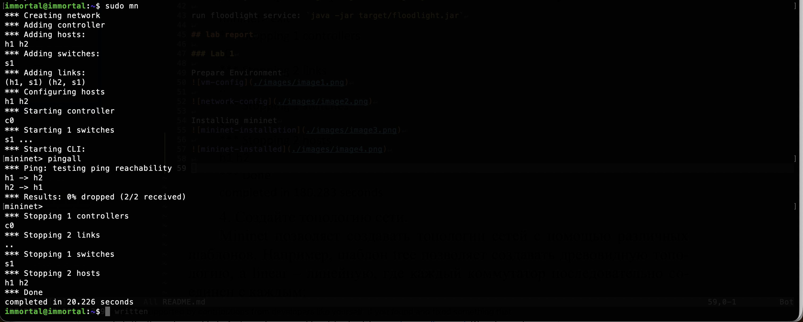
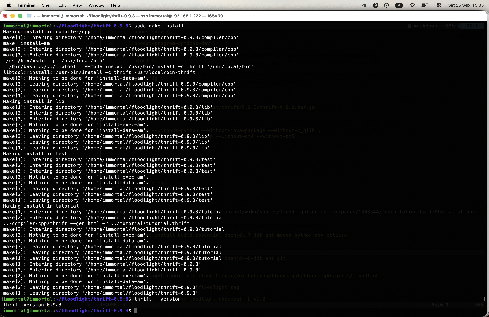
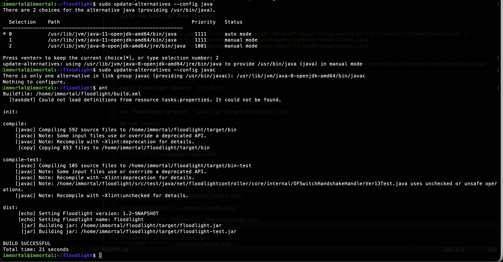
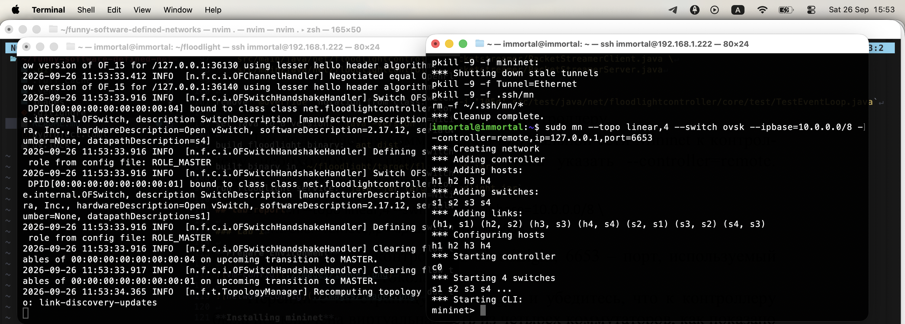
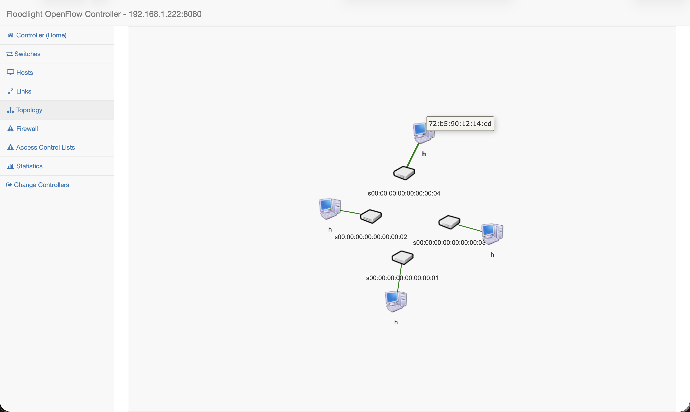

# funny-software-defined-networks

## Installation Docs

### initial configuration

update packages: `sudo apt-get update -y && sudo apt-get upgrade -y`

### mininet installation

reference: https://mininet.org/download/

clone mininet repo: `git clone https://github.com/mininet/mininet ~/mininet`

show actual tags: `git -C ~/mininet tag`

checkout tag: `git -C ~/mininet checkout -b 2.3.0`

install mininet: `mininet/util/install.sh -a`

### floodlight installation

build and install thrift 0.9.3

```
sudo apt install -y \
    libboost-dev \
    libboost-test-dev \
    libboost-program-options-dev \
    libevent-dev \
    automake \
    libtool \
    flex \
    bison \
    pkg-config \
    g++ \
    libssl-dev \
    make

wget http://archive.apache.org/dist/thrift/0.9.3/thrift-0.9.3.tar.gz
tar -xzf thrift-0.9.3.tar.gz
cd thrift-0.9.3

./configure --without-python --without-java-package --without-c_glib \
    --without-tests --without-cpp --without-qt4 --without-qt5

make -j$(nproc)

sudo make install

hash -r

thrift --version
```

install required packages:

reference: https://floodlight.atlassian.net/wiki/spaces/floodlightcontroller/pages/1343544/Installation+Guide#Installation

```
# ubuntu < 22.04
sudo apt-get install build-essential openjdk-7-jdk ant maven python-dev eclipse

# actual, ubuntu 22.04

sudo apt-get install build-essential openjdk-8-jdk ant git
```

clone floodlight repo: `git clone https://github.com/floodlight/floodlight.git ~/floodlight`

show actual tags: `git -C ~/floodlight tag`

checkout tag: `git -C ~/floodlight checkout -b v1.2`

init submodules: `git -C ~/floodlight submodules update --init`

chdir to floodlight: `cd ~/floodlight`

replace libthrift binary: `wget https://repo1.maven.org/maven2/org/apache/thrift/libthrift/0.9.3/libthrift-0.9.3.jar -O lib/libthrift-0.9.0.jar`

generate new thrift files:

```
find . -name "*.thrift"

rm -rf lib/gen-java/net/floodlightcontroller/packetstreamer/thrift
rm -rf lib/gen-java/org/sdnplatform/sync/thrift

thrift --gen java -out lib/gen-java src/main/thrift/packetstreamer.thrift
thrift --gen java -out lib/gen-java src/main/thrift/sync.thrift
```

apply new path for Java classes:

```
sed -i 's/org\.apache\.thrift\.transport\.layered\.TFramedTransport/org.apache.thrift.transport.TFramedTransport/' \
    src/main/java/net/floodlightcontroller/packetstreamer/PacketStreamerClient.java \
    src/main/java/net/floodlightcontroller/packetstreamer/PacketStreamerServer.java
```

remove `@Override` notation from class:

`sed -i '105d' src/test/java/net/floodlightcontroller/core/test/TestEventLoop.java`

set java to 8 version: `java -version`

build floodlight binary: `ant dist`

built binary in `~/floodlight/target/floodlight.jar`

run floodlight service: `java -jar target/floodlight.jar`

## lab report

### Lab 1

**Prepare Environment**


**Installing mininet**








**Install floodlight**




**Build floodlight binary**



**Run floodlight service**


**Result**



