# ADR-0002. Архитектура стенда: Mininet + Open vSwitch + Floodlight

- **Статус:** Accepted
- **Дата:** 2026-10-08
- **Спецификации:** `openspec/specs/sdn-lab-environment`,
  `openspec/specs/lab1-sdn-testbed`

## Контекст

Лабораторные работы требуют SDN-сети с разделением плоскостей управления и
данных, наблюдаемым протоколом OpenFlow, управлением политиками через
контроллер и программным построением топологий с заданными характеристиками
каналов. Всё должно работать на одной ВМ без физического оборудования.

## Решение

Стенд строится из трёх компонентов на одной ВМ Ubuntu 22.04:

| Компонент                   | Роль                                                                                                                              | Интерфейсы                                       |
| --------------------------- | --------------------------------------------------------------------------------------------------------------------------------- | ------------------------------------------------ |
| **Mininet 2.3**             | эмулятор сети: создаёт хосты (network namespaces), каналы (veth) и коммутаторы по описанию топологии; Python API и CLI `mn`       | Python API `Topo`/`Mininet`, CLI `mininet>`      |
| **TCLink / CPULimitedHost** | эмуляция характеристик: `tc` htb/netem (bw, delay, loss, очередь), cgroups (доля CPU)                                             | параметры `addLink(**LinkOpts)`, `addHost(cpu=)` |
| **Open vSwitch 2.17**       | плоскость данных: программные коммутаторы с таблицами потоков, исполняют правила OpenFlow; режим standalone + STP без контроллера | OpenFlow 1.3, `ovs-ofctl`, `ovs-vsctl`           |
| **OpenFlow 1.3**            | протокол между коммутатором и контроллером поверх TCP 6653: `PACKET_IN`, `PACKET_OUT`, `FLOW_MOD`, `ECHO`, handshake              | TCP 6653                                         |
| **Floodlight v1.2**         | плоскость управления: обнаружение топологии, учёт хостов, вычисление маршрутов, установка правил, политики ACL                    | OpenFlow :6653, REST и Web UI :8080              |
| – OFSwitchManager           | handshake, роль MASTER, keep-alive                                                                                                |                                                  |
| – LinkDiscoveryManager      | LLDP через `PACKET_OUT`/`PACKET_IN`, граф связей                                                                                  | `/wm/topology/links/json`                        |
| – TopologyManager           | остовное дерево для broadcast, кратчайшие пути                                                                                    |                                                  |
| – DeviceManager             | хосты: MAC, IP, точка подключения                                                                                                 | `/wm/device/`                                    |
| – Forwarding                | реактивная пересылка: `FLOW_MOD` priority 1, idle 5 с                                                                             |                                                  |
| – ACL                       | проактивные правила DROP priority 30000                                                                                           | `/wm/acl/rules/json`, UI                         |
| **tshark / Wireshark**      | наблюдение обмена OpenFlow                                                                                                        | захват `tcp port 6653`                           |
| **Репозиторий**             | топологии lab 4 (`reports/lab4/topologies`), тесты (`tests/`), `make test`                                                        | Mininet API, REST Floodlight                     |

Процессы взаимодействия компонентов – [processes.md](./processes.md).

## Рассмотренные альтернативы

- **Ryu / ONOS / OpenDaylight вместо Floodlight.** Работы выполняются на
  Floodlight: у него есть web UI, REST API и модуль ACL «из коробки».
- **Reference controller Mininet (`c0`).** Используется для простых
  топологий без петель (`LinearTopo.py`, `TreeTopo.py` по умолчанию). Он не
  умеет работать с петлями и не даёт REST API.
- **Физические коммутаторы.** Недоступны и не нужны для целей работ.

## Последствия

- Floodlight 1.2 требует Java 8 и патчей Thrift для сборки на Ubuntu 22.04
  (`openspec/specs/lab1-sdn-testbed`).
- Связка Floodlight 1.2 + OVS 2.17 имеет дефекты совместимости, требующие
  обходов: ADR-0004, ADR-0005, ADR-0006.
- Контроллер `c0` и Floodlight занимают один порт 6653 и не могут работать
  одновременно.
- Mininet и OVS требуют root: все эксперименты и integration-тесты идут через
  `sudo`.
