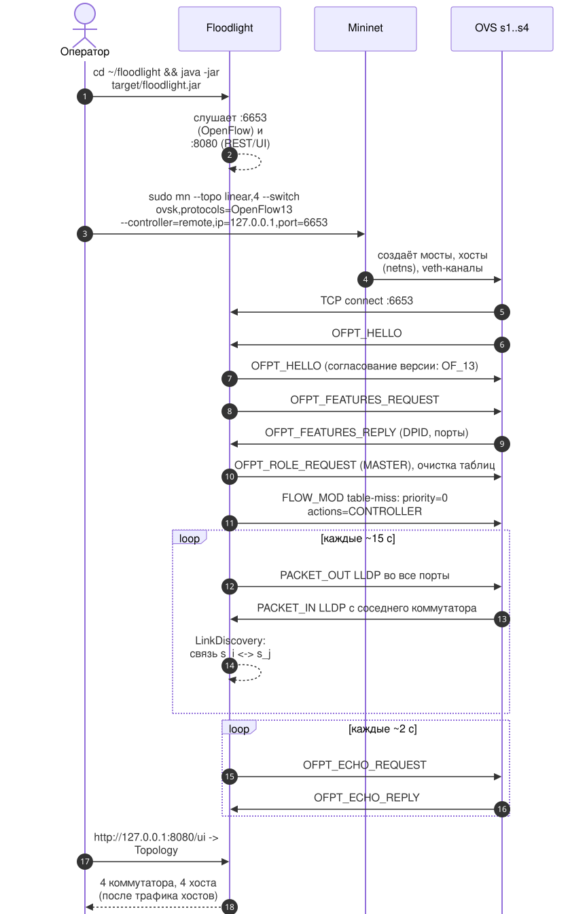
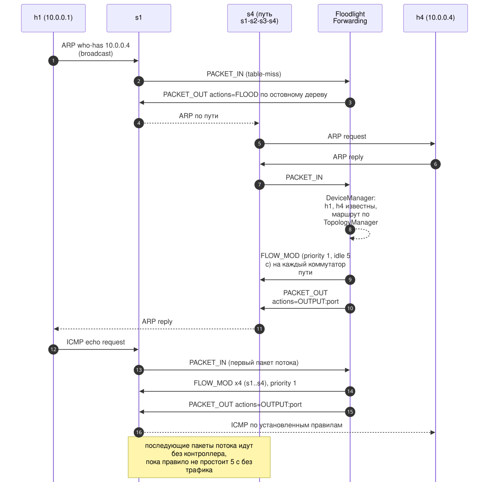
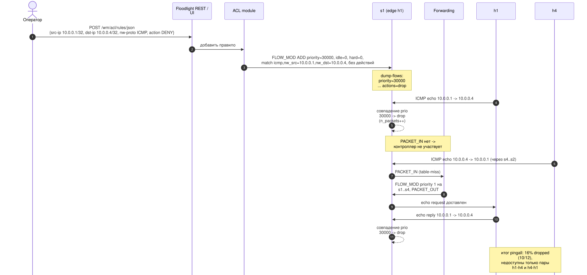
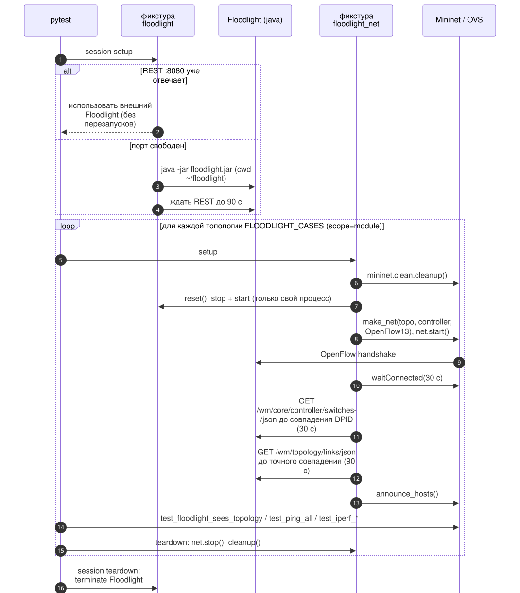
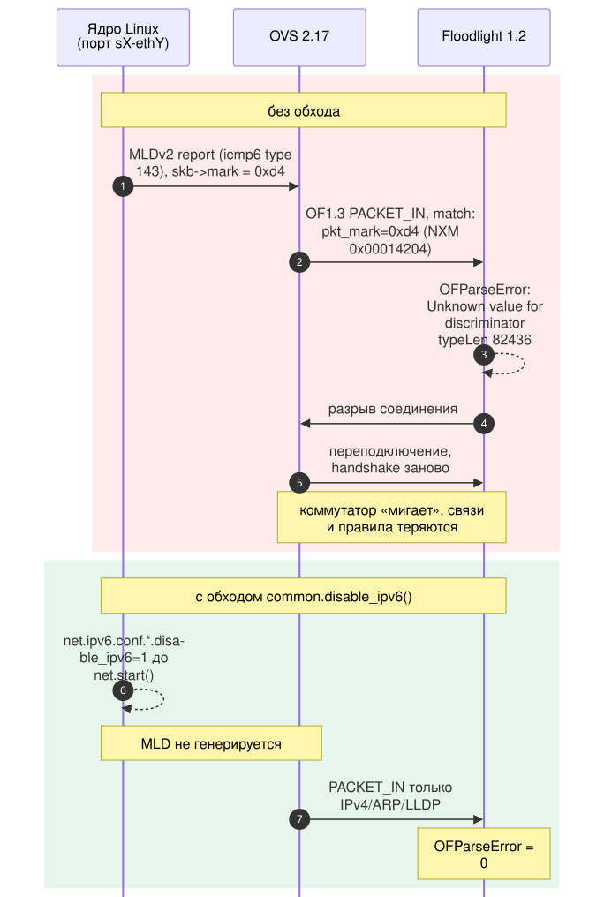
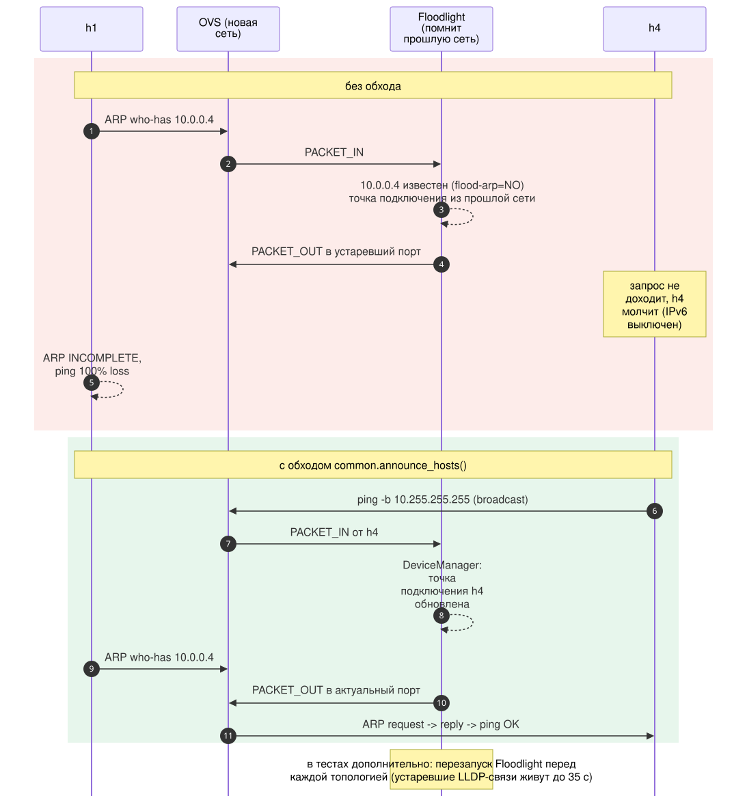

# Процессы взаимодействия компонентов

Схемы сценариев работы стенда. Роли компонентов и общая схема –
[ADR-0002](./0002-sdn-stand-architecture.md). Исходники схем –
[`diagrams/*.mmd`](./diagrams/), перегенерация – `make diagrams`.

| #   | Сценарий                                                                             | Лаба / область | Тип       |
| --- | ------------------------------------------------------------------------------------ | -------------- | --------- |
| P1  | [Подключение коммутаторов к контроллеру](#p1-подключение-коммутаторов-к-контроллеру) | lab 1          | sequence  |
| P2  | [Реактивная пересылка первого пакета](#p2-реактивная-пересылка-первого-пакета)       | lab 2          | sequence  |
| P3  | [Захват и анализ OpenFlow](#p3-захват-и-анализ-openflow)                             | lab 2          | flowchart |
| P4  | [Проактивное правило ACL](#p4-проактивное-правило-acl)                               | lab 3          | sequence  |
| P5  | [Запуск скрипта топологии](#p5-запуск-скрипта-топологии)                             | lab 4          | flowchart |
| P6  | [Обработка петли в кольце](#p6-обработка-петли-в-кольце)                             | lab 4          | flowchart |
| P7  | [make test](#p7-make-test)                                                           | тесты          | flowchart |
| P8  | [Жизненный цикл Floodlight в тестах](#p8-жизненный-цикл-floodlight-в-тестах)         | тесты          | sequence  |
| P9  | [Дефект pkt_mark и его обход](#p9-дефект-pkt_mark-и-его-обход)                       | Floodlight     | sequence  |
| P10 | [Устаревшая точка подключения хоста](#p10-устаревшая-точка-подключения-хоста)        | Floodlight     | sequence  |

## P1. Подключение коммутаторов к контроллеру

Floodlight поднимает слушатели OpenFlow и REST. Mininet создаёт сеть, каждый
OVS-мост подключается к :6653: согласование версии (`HELLO`), `FEATURES`,
роль MASTER, установка table-miss. Затем идут периодическое обнаружение
связей через LLDP и keep-alive `ECHO`. Спецификация:
`openspec/specs/lab1-sdn-testbed`.

## P2. Реактивная пересылка первого пакета

Пакет без совпадения в таблице потоков попадает на контроллер
(`PACKET_IN`). Forwarding вычисляет путь, ставит `FLOW_MOD` на коммутаторы
пути и отправляет исходный пакет через `PACKET_OUT`. Дальше поток идёт без
контроллера, пока правило не простоит 5 с без трафика. Спецификация:
`openspec/specs/lab2-openflow-capture`.

## P3. Захват и анализ OpenFlow

Порядок действий lab 2: захват запускается до подключения сети, чтобы в него
попал handshake. Спецификация: `openspec/specs/lab2-openflow-capture`.

## P4. Проактивное правило ACL

Правило ACL уходит на пограничный коммутатор источника одним `FLOW_MOD`
priority 30000 без `PACKET_IN`. Заблокированный трафик отбрасывается на s1 и
не доходит до контроллера. Ответы h1 на запросы h4 попадают под то же
правило. Спецификация: `openspec/specs/lab3-acl-flow-rules`.

## P5. Запуск скрипта топологии

Общий путь всех скриптов lab 4: разбор аргументов → `Topo.build()` → сборка
сети (с контроллером `c0` или через `common.make_net()`) → ожидание в
зависимости от режима → измерения → `net.stop()` в `finally`.
Решения: [ADR-0009](./0009-modern-topology-code.md),
[ADR-0004](./0004-disable-ipv6-with-floodlight.md),
[ADR-0005](./0005-announce-hosts.md).

## P6. Обработка петли в кольце

Без контроллера, учитывающего топологию, и без STP кольцо порождает
broadcast storm. Решение: [ADR-0008](./0008-ring-loop-handling.md).

## P7. make test

Одна команда: окружение, unit-тесты на фикстурах, Mininet без контроллера,
Mininet + Floodlight. Решение: [ADR-0007](./0007-test-harness.md).

## P8. Жизненный цикл Floodlight в тестах

Контроллер запускается тестами и перезапускается перед каждой топологией;
готовность сети – точное совпадение коммутаторов и связей в REST. Решение:
[ADR-0006](./0006-isolate-floodlight-state-in-tests.md).

## P9. Дефект pkt_mark и его обход

MLD-отчёты с меткой ядра превращаются в неизвестное Floodlight поле
`pkt_mark` в OF 1.3 packet-in, и контроллер рвёт соединение. Решение:
[ADR-0004](./0004-disable-ipv6-with-floodlight.md).

## P10. Устаревшая точка подключения хоста

Floodlight не флудит ARP к известным IP и отправляет запрос в старый порт.
Широковещательный ping от каждого хоста обновляет его расположение. Решения:
[ADR-0005](./0005-announce-hosts.md),
[ADR-0006](./0006-isolate-floodlight-state-in-tests.md).

