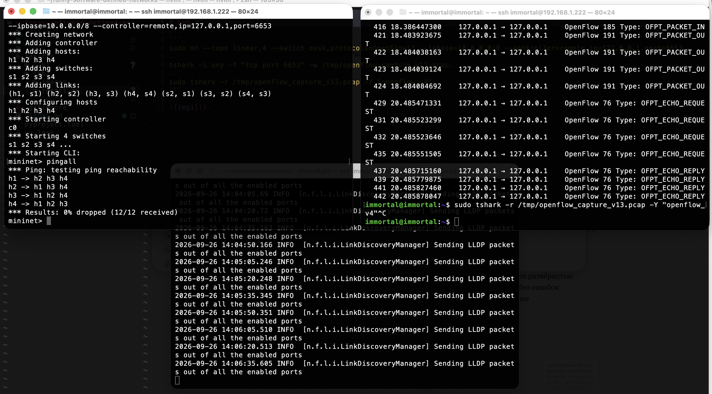

# Lab 2

```
sudo mn --topo linear,4 --switch ovsk,protocols=OpenFlow13 --ipbase=10.0.0.0/8 --controller=remote,ip=127.0.0.1,port=6653

tshark -i any -f "tcp port 6653" -w /tmp/openflow_capture_v13.pcap

sudo tshark -r /tmp/openflow_capture_v13.pcap -Y "openflow_v4"
```



```
immortal@immortal:~$ sudo tshark -r /tmp/openflow_capture_v13.pcap -Y "openflow_v4"
Running as user "root" and group "root". This could be dangerous.
    1 0.000000000    127.0.0.1 → 127.0.0.1    OpenFlow 180 Type: OFPT_PACKET_IN
    3 0.256351902    127.0.0.1 → 127.0.0.1    OpenFlow 180 Type: OFPT_PACKET_IN
    5 0.464920402    127.0.0.1 → 127.0.0.1    OpenFlow 76 Type: OFPT_ECHO_REQUEST
    7 0.465341264    127.0.0.1 → 127.0.0.1    OpenFlow 76 Type: OFPT_ECHO_REPLY
    9 0.465686755    127.0.0.1 → 127.0.0.1    OpenFlow 76 Type: OFPT_ECHO_REQUEST
   11 0.465793366    127.0.0.1 → 127.0.0.1    OpenFlow 76 Type: OFPT_ECHO_REPLY
   12 0.466532598    127.0.0.1 → 127.0.0.1    OpenFlow 76 Type: OFPT_ECHO_REQUEST
   14 0.466668719    127.0.0.1 → 127.0.0.1    OpenFlow 76 Type: OFPT_ECHO_REPLY
   16 0.466978109    127.0.0.1 → 127.0.0.1    OpenFlow 76 Type: OFPT_ECHO_REQUEST
   18 0.467116435    127.0.0.1 → 127.0.0.1    OpenFlow 76 Type: OFPT_ECHO_REPLY
   21 1.024043743    127.0.0.1 → 127.0.0.1    OpenFlow 180 Type: OFPT_PACKET_IN
   23 1.024158193    127.0.0.1 → 127.0.0.1    OpenFlow 180 Type: OFPT_PACKET_IN
   25 1.024186319    127.0.0.1 → 127.0.0.1    OpenFlow 180 Type: OFPT_PACKET_IN
   27 1.024751911    127.0.0.1 → 127.0.0.1    OpenFlow 178 Type: OFPT_PACKET_OUT
   28 1.024897745    127.0.0.1 → 127.0.0.1    OpenFlow 194 Type: OFPT_PACKET_OUT
   29 1.024950054    127.0.0.1 → 127.0.0.1    OpenFlow 194 Type: OFPT_PACKET_OUT
   30 1.024961077    127.0.0.1 → 127.0.0.1    OpenFlow 180 Type: OFPT_PACKET_IN
   31 1.025108656    127.0.0.1 → 127.0.0.1    OpenFlow 180 Type: OFPT_PACKET_IN
   33 1.025149899    127.0.0.1 → 127.0.0.1    OpenFlow 194 Type: OFPT_PACKET_OUT
   34 1.025161562    127.0.0.1 → 127.0.0.1    OpenFlow 180 Type: OFPT_PACKET_IN
   36 1.025322047    127.0.0.1 → 127.0.0.1    OpenFlow 180 Type: OFPT_PACKET_IN
   38 1.025437478    127.0.0.1 → 127.0.0.1    OpenFlow 194 Type: OFPT_PACKET_OUT
   39 1.025473193    127.0.0.1 → 127.0.0.1    OpenFlow 194 Type: OFPT_PACKET_OUT
   41 1.025568822    127.0.0.1 → 127.0.0.1    OpenFlow 178 Type: OFPT_PACKET_OUT
   42 1.025661626    127.0.0.1 → 127.0.0.1    OpenFlow 180 Type: OFPT_PACKET_IN
   44 1.025688579    127.0.0.1 → 127.0.0.1    OpenFlow 180 Type: OFPT_PACKET_IN
   46 1.025734632    127.0.0.1 → 127.0.0.1    OpenFlow 180 Type: OFPT_PACKET_IN
   47 1.025928840    127.0.0.1 → 127.0.0.1    OpenFlow 194 Type: OFPT_PACKET_OUT
   48 1.025956827    127.0.0.1 → 127.0.0.1    OpenFlow 178 Type: OFPT_PACKET_OUT
   49 1.025992296    127.0.0.1 → 127.0.0.1    OpenFlow 178 Type: OFPT_PACKET_OUT
   51 1.026235398    127.0.0.1 → 127.0.0.1    OpenFlow 180 Type: OFPT_PACKET_IN
   52 1.026430657    127.0.0.1 → 127.0.0.1    OpenFlow 178 Type: OFPT_PACKET_OUT
   56 2.048204732    127.0.0.1 → 127.0.0.1    OpenFlow 180 Type: OFPT_PACKET_IN
   57 2.048873216    127.0.0.1 → 127.0.0.1    OpenFlow 178 Type: OFPT_PACKET_OUT
   59 2.049300739    127.0.0.1 → 127.0.0.1    OpenFlow 180 Type: OFPT_PACKET_IN
   60 2.049700449    127.0.0.1 → 127.0.0.1    OpenFlow 194 Type: OFPT_PACKET_OUT
   62 2.050042137    127.0.0.1 → 127.0.0.1    OpenFlow 180 Type: OFPT_PACKET_IN
   63 2.050796756    127.0.0.1 → 127.0.0.1    OpenFlow 194 Type: OFPT_PACKET_OUT
   64 2.051118997    127.0.0.1 → 127.0.0.1    OpenFlow 180 Type: OFPT_PACKET_IN
   65 2.051410253    127.0.0.1 → 127.0.0.1    OpenFlow 178 Type: OFPT_PACKET_OUT
   68 3.071963680    127.0.0.1 → 127.0.0.1    OpenFlow 180 Type: OFPT_PACKET_IN
   70 3.382358393    127.0.0.1 → 127.0.0.1    OpenFlow 183 Type: OFPT_PACKET_OUT
   71 3.382358416    127.0.0.1 → 127.0.0.1    OpenFlow 183 Type: OFPT_PACKET_OUT
   74 3.382453113    127.0.0.1 → 127.0.0.1    OpenFlow 183 Type: OFPT_PACKET_OUT
   75 3.382456501    127.0.0.1 → 127.0.0.1    OpenFlow 183 Type: OFPT_PACKET_OUT
   78 3.382494116    127.0.0.1 → 127.0.0.1    OpenFlow 183 Type: OFPT_PACKET_OUT
   80 3.382507755    127.0.0.1 → 127.0.0.1    OpenFlow 183 Type: OFPT_PACKET_OUT
   81 3.382514308    127.0.0.1 → 127.0.0.1    OpenFlow 183 Type: OFPT_PACKET_OUT
   84 3.382560059    127.0.0.1 → 127.0.0.1    OpenFlow 183 Type: OFPT_PACKET_OUT
   86 3.382588636    127.0.0.1 → 127.0.0.1    OpenFlow 183 Type: OFPT_PACKET_OUT
   88 3.382621272    127.0.0.1 → 127.0.0.1    OpenFlow 183 Type: OFPT_PACKET_OUT
   90 3.383004274    127.0.0.1 → 127.0.0.1    OpenFlow 185 Type: OFPT_PACKET_IN
   92 3.383059549    127.0.0.1 → 127.0.0.1    OpenFlow 185 Type: OFPT_PACKET_IN
   93 3.383106761    127.0.0.1 → 127.0.0.1    OpenFlow 185 Type: OFPT_PACKET_IN
   94 3.383132997    127.0.0.1 → 127.0.0.1    OpenFlow 185 Type: OFPT_PACKET_IN
   96 3.383215561    127.0.0.1 → 127.0.0.1    OpenFlow 185 Type: OFPT_PACKET_IN
   97 3.383265541    127.0.0.1 → 127.0.0.1    OpenFlow 185 Type: OFPT_PACKET_IN
  100 3.458801771    127.0.0.1 → 127.0.0.1    OpenFlow 191 Type: OFPT_PACKET_OUT
  101 3.459154331    127.0.0.1 → 127.0.0.1    OpenFlow 191 Type: OFPT_PACKET_OUT
  102 3.459250104    127.0.0.1 → 127.0.0.1    OpenFlow 191 Type: OFPT_PACKET_OUT
  103 3.459289737    127.0.0.1 → 127.0.0.1    OpenFlow 191 Type: OFPT_PACKET_OUT
  108 5.119889285    127.0.0.1 → 127.0.0.1    OpenFlow 180 Type: OFPT_PACKET_IN
  110 5.119986438    127.0.0.1 → 127.0.0.1    OpenFlow 180 Type: OFPT_PACKET_IN
  111 5.120595620    127.0.0.1 → 127.0.0.1    OpenFlow 194 Type: OFPT_PACKET_OUT
  113 5.121175417    127.0.0.1 → 127.0.0.1    OpenFlow 180 Type: OFPT_PACKET_IN
  114 5.121865979    127.0.0.1 → 127.0.0.1    OpenFlow 194 Type: OFPT_PACKET_OUT
  116 5.122219475    127.0.0.1 → 127.0.0.1    OpenFlow 180 Type: OFPT_PACKET_IN
  118 5.122483918    127.0.0.1 → 127.0.0.1    OpenFlow 178 Type: OFPT_PACKET_OUT
  120 5.460060823    127.0.0.1 → 127.0.0.1    OpenFlow 76 Type: OFPT_ECHO_REQUEST
  122 5.460325893    127.0.0.1 → 127.0.0.1    OpenFlow 76 Type: OFPT_ECHO_REPLY
  124 7.121392892    127.0.0.1 → 127.0.0.1    OpenFlow 76 Type: OFPT_ECHO_REQUEST
  126 7.121732604    127.0.0.1 → 127.0.0.1    OpenFlow 76 Type: OFPT_ECHO_REPLY
  127 7.122727627    127.0.0.1 → 127.0.0.1    OpenFlow 76 Type: OFPT_ECHO_REQUEST
  129 7.122871015    127.0.0.1 → 127.0.0.1    OpenFlow 76 Type: OFPT_ECHO_REPLY
  130 7.123798083    127.0.0.1 → 127.0.0.1    OpenFlow 76 Type: OFPT_ECHO_REQUEST
  132 7.123923461    127.0.0.1 → 127.0.0.1    OpenFlow 76 Type: OFPT_ECHO_REPLY
  136 7.461889207    127.0.0.1 → 127.0.0.1    OpenFlow 76 Type: OFPT_ECHO_REQUEST
  137 7.462164111    127.0.0.1 → 127.0.0.1    OpenFlow 76 Type: OFPT_ECHO_REPLY
  139 9.123211620    127.0.0.1 → 127.0.0.1    OpenFlow 76 Type: OFPT_ECHO_REQUEST
  140 9.123544295    127.0.0.1 → 127.0.0.1    OpenFlow 76 Type: OFPT_ECHO_REPLY
  142 9.125392772    127.0.0.1 → 127.0.0.1    OpenFlow 76 Type: OFPT_ECHO_REQUEST
  143 9.125624414    127.0.0.1 → 127.0.0.1    OpenFlow 76 Type: OFPT_ECHO_REPLY
  145 9.126242280    127.0.0.1 → 127.0.0.1    OpenFlow 76 Type: OFPT_ECHO_REQUEST
  146 9.126352099    127.0.0.1 → 127.0.0.1    OpenFlow 76 Type: OFPT_ECHO_REPLY
  148 9.462107919    127.0.0.1 → 127.0.0.1    OpenFlow 76 Type: OFPT_ECHO_REQUEST
  149 9.462257037    127.0.0.1 → 127.0.0.1    OpenFlow 76 Type: OFPT_ECHO_REPLY
  151 11.123563952    127.0.0.1 → 127.0.0.1    OpenFlow 76 Type: OFPT_ECHO_REQUEST
  152 11.123847840    127.0.0.1 → 127.0.0.1    OpenFlow 76 Type: OFPT_ECHO_REPLY
  154 11.125521632    127.0.0.1 → 127.0.0.1    OpenFlow 76 Type: OFPT_ECHO_REQUEST
  155 11.125660732    127.0.0.1 → 127.0.0.1    OpenFlow 76 Type: OFPT_ECHO_REPLY
  157 11.127473383    127.0.0.1 → 127.0.0.1    OpenFlow 76 Type: OFPT_ECHO_REQUEST
  158 11.127615611    127.0.0.1 → 127.0.0.1    OpenFlow 76 Type: OFPT_ECHO_REPLY
  160 11.464600642    127.0.0.1 → 127.0.0.1    OpenFlow 76 Type: OFPT_ECHO_REQUEST
  161 11.464785202    127.0.0.1 → 127.0.0.1    OpenFlow 76 Type: OFPT_ECHO_REPLY
  163 13.123798144    127.0.0.1 → 127.0.0.1    OpenFlow 76 Type: OFPT_ECHO_REQUEST
  164 13.123970971    127.0.0.1 → 127.0.0.1    OpenFlow 76 Type: OFPT_ECHO_REPLY
  166 13.127873526    127.0.0.1 → 127.0.0.1    OpenFlow 76 Type: OFPT_ECHO_REQUEST
  167 13.128050097    127.0.0.1 → 127.0.0.1    OpenFlow 76 Type: OFPT_ECHO_REPLY
  169 13.129867117    127.0.0.1 → 127.0.0.1    OpenFlow 76 Type: OFPT_ECHO_REQUEST
  170 13.129976247    127.0.0.1 → 127.0.0.1    OpenFlow 76 Type: OFPT_ECHO_REPLY
  172 13.464863808    127.0.0.1 → 127.0.0.1    OpenFlow 76 Type: OFPT_ECHO_REQUEST
  173 13.465016824    127.0.0.1 → 127.0.0.1    OpenFlow 76 Type: OFPT_ECHO_REPLY
  175 15.125396951    127.0.0.1 → 127.0.0.1    OpenFlow 76 Type: OFPT_ECHO_REQUEST
  176 15.125670846    127.0.0.1 → 127.0.0.1    OpenFlow 76 Type: OFPT_ECHO_REPLY
  178 15.128326557    127.0.0.1 → 127.0.0.1    OpenFlow 76 Type: OFPT_ECHO_REQUEST
  179 15.128491171    127.0.0.1 → 127.0.0.1    OpenFlow 76 Type: OFPT_ECHO_REPLY
  181 15.130306933    127.0.0.1 → 127.0.0.1    OpenFlow 76 Type: OFPT_ECHO_REQUEST
  182 15.130428605    127.0.0.1 → 127.0.0.1    OpenFlow 76 Type: OFPT_ECHO_REPLY
  184 15.467416944    127.0.0.1 → 127.0.0.1    OpenFlow 76 Type: OFPT_ECHO_REQUEST
  185 15.467579878    127.0.0.1 → 127.0.0.1    OpenFlow 76 Type: OFPT_ECHO_REPLY
  187 17.127200059    127.0.0.1 → 127.0.0.1    OpenFlow 76 Type: OFPT_ECHO_REQUEST
  188 17.127490528    127.0.0.1 → 127.0.0.1    OpenFlow 76 Type: OFPT_ECHO_REPLY
  190 17.130706233    127.0.0.1 → 127.0.0.1    OpenFlow 76 Type: OFPT_ECHO_REQUEST
  191 17.130850274    127.0.0.1 → 127.0.0.1    OpenFlow 76 Type: OFPT_ECHO_REPLY
  193 17.131665471    127.0.0.1 → 127.0.0.1    OpenFlow 76 Type: OFPT_ECHO_REQUEST
  194 17.131771396    127.0.0.1 → 127.0.0.1    OpenFlow 76 Type: OFPT_ECHO_REPLY
  196 17.467650269    127.0.0.1 → 127.0.0.1    OpenFlow 76 Type: OFPT_ECHO_REQUEST
  197 17.467802586    127.0.0.1 → 127.0.0.1    OpenFlow 76 Type: OFPT_ECHO_REPLY
  199 17.934531275    127.0.0.1 → 127.0.0.1    OpenFlow 152 Type: OFPT_PACKET_IN
  201 17.935984671    127.0.0.1 → 127.0.0.1    OpenFlow 150 Type: OFPT_PACKET_OUT
  202 17.936506771    127.0.0.1 → 127.0.0.1    OpenFlow 152 Type: OFPT_PACKET_IN
  204 17.936814072    127.0.0.1 → 127.0.0.1    OpenFlow 166 Type: OFPT_PACKET_OUT
  205 17.937343766    127.0.0.1 → 127.0.0.1    OpenFlow 152 Type: OFPT_PACKET_IN
  207 17.937396581    127.0.0.1 → 127.0.0.1    OpenFlow 152 Type: OFPT_PACKET_IN
  208 17.937628402    127.0.0.1 → 127.0.0.1    OpenFlow 166 Type: OFPT_PACKET_OUT
  209 17.938184935    127.0.0.1 → 127.0.0.1    OpenFlow 152 Type: OFPT_PACKET_IN
  211 17.938412184    127.0.0.1 → 127.0.0.1    OpenFlow 150 Type: OFPT_PACKET_OUT
  212 17.952499418    127.0.0.1 → 127.0.0.1    OpenFlow 180 Type: OFPT_FLOW_MOD
  213 17.952567624    127.0.0.1 → 127.0.0.1    OpenFlow 180 Type: OFPT_FLOW_MOD
  214 17.952576854    127.0.0.1 → 127.0.0.1    OpenFlow 150 Type: OFPT_PACKET_OUT
  217 17.953270603    127.0.0.1 → 127.0.0.1    OpenFlow 208 Type: OFPT_PACKET_IN
  218 17.955914239    127.0.0.1 → 127.0.0.1    OpenFlow 196 Type: OFPT_FLOW_MOD
  219 17.955990473    127.0.0.1 → 127.0.0.1    OpenFlow 196 Type: OFPT_FLOW_MOD
  220 17.956034071    127.0.0.1 → 127.0.0.1    OpenFlow 206 Type: OFPT_PACKET_OUT
  222 17.956349082    127.0.0.1 → 127.0.0.1    OpenFlow 208 Type: OFPT_PACKET_IN
  223 17.956571720    127.0.0.1 → 127.0.0.1    OpenFlow 222 Type: OFPT_PACKET_OUT
  224 17.956987984    127.0.0.1 → 127.0.0.1    OpenFlow 208 Type: OFPT_PACKET_IN
  225 17.957028863    127.0.0.1 → 127.0.0.1    OpenFlow 208 Type: OFPT_PACKET_IN
  226 17.957601222    127.0.0.1 → 127.0.0.1    OpenFlow 196 Type: OFPT_FLOW_MOD
  227 17.957630851    127.0.0.1 → 127.0.0.1    OpenFlow 222 Type: OFPT_PACKET_OUT
  228 17.957657586    127.0.0.1 → 127.0.0.1    OpenFlow 196 Type: OFPT_FLOW_MOD
  229 17.957697893    127.0.0.1 → 127.0.0.1    OpenFlow 206 Type: OFPT_PACKET_OUT
  231 17.957980883    127.0.0.1 → 127.0.0.1    OpenFlow 208 Type: OFPT_PACKET_IN
  232 17.958236641    127.0.0.1 → 127.0.0.1    OpenFlow 206 Type: OFPT_PACKET_OUT
  233 17.960634528    127.0.0.1 → 127.0.0.1    OpenFlow 152 Type: OFPT_PACKET_IN
  234 17.960988771    127.0.0.1 → 127.0.0.1    OpenFlow 150 Type: OFPT_PACKET_OUT
  235 17.961348970    127.0.0.1 → 127.0.0.1    OpenFlow 152 Type: OFPT_PACKET_IN
  236 17.961562005    127.0.0.1 → 127.0.0.1    OpenFlow 166 Type: OFPT_PACKET_OUT
  237 17.961866187    127.0.0.1 → 127.0.0.1    OpenFlow 152 Type: OFPT_PACKET_IN
  238 17.962155458    127.0.0.1 → 127.0.0.1    OpenFlow 166 Type: OFPT_PACKET_OUT
  239 17.962413663    127.0.0.1 → 127.0.0.1    OpenFlow 152 Type: OFPT_PACKET_IN
  240 17.962470696    127.0.0.1 → 127.0.0.1    OpenFlow 152 Type: OFPT_PACKET_IN
  241 17.962617880    127.0.0.1 → 127.0.0.1    OpenFlow 150 Type: OFPT_PACKET_OUT
  242 17.963744483    127.0.0.1 → 127.0.0.1    OpenFlow 180 Type: OFPT_FLOW_MOD
  243 17.963799571    127.0.0.1 → 127.0.0.1    OpenFlow 180 Type: OFPT_FLOW_MOD
  245 17.963856055    127.0.0.1 → 127.0.0.1    OpenFlow 180 Type: OFPT_FLOW_MOD
  246 17.963899511    127.0.0.1 → 127.0.0.1    OpenFlow 150 Type: OFPT_PACKET_OUT
  249 17.964695417    127.0.0.1 → 127.0.0.1    OpenFlow 208 Type: OFPT_PACKET_IN
  250 17.965288992    127.0.0.1 → 127.0.0.1    OpenFlow 196 Type: OFPT_FLOW_MOD
  251 17.965375372    127.0.0.1 → 127.0.0.1    OpenFlow 196 Type: OFPT_FLOW_MOD
  252 17.965458013    127.0.0.1 → 127.0.0.1    OpenFlow 196 Type: OFPT_FLOW_MOD
  253 17.965498162    127.0.0.1 → 127.0.0.1    OpenFlow 206 Type: OFPT_PACKET_OUT
  255 17.965881665    127.0.0.1 → 127.0.0.1    OpenFlow 208 Type: OFPT_PACKET_IN
  256 17.966242041    127.0.0.1 → 127.0.0.1    OpenFlow 222 Type: OFPT_PACKET_OUT
  257 17.966525634    127.0.0.1 → 127.0.0.1    OpenFlow 208 Type: OFPT_PACKET_IN
  258 17.966597524    127.0.0.1 → 127.0.0.1    OpenFlow 208 Type: OFPT_PACKET_IN
  259 17.966917990    127.0.0.1 → 127.0.0.1    OpenFlow 206 Type: OFPT_PACKET_OUT
  260 17.967175866    127.0.0.1 → 127.0.0.1    OpenFlow 196 Type: OFPT_FLOW_MOD
  261 17.967269728    127.0.0.1 → 127.0.0.1    OpenFlow 196 Type: OFPT_FLOW_MOD
  263 17.967314894    127.0.0.1 → 127.0.0.1    OpenFlow 196 Type: OFPT_FLOW_MOD
  264 17.967354199    127.0.0.1 → 127.0.0.1    OpenFlow 206 Type: OFPT_PACKET_OUT
  266 17.969831069    127.0.0.1 → 127.0.0.1    OpenFlow 152 Type: OFPT_PACKET_IN
  267 17.970157647    127.0.0.1 → 127.0.0.1    OpenFlow 150 Type: OFPT_PACKET_OUT
  268 17.970407408    127.0.0.1 → 127.0.0.1    OpenFlow 152 Type: OFPT_PACKET_IN
  269 17.970626037    127.0.0.1 → 127.0.0.1    OpenFlow 166 Type: OFPT_PACKET_OUT
  270 17.971038230    127.0.0.1 → 127.0.0.1    OpenFlow 152 Type: OFPT_PACKET_IN
  271 17.971249734    127.0.0.1 → 127.0.0.1    OpenFlow 166 Type: OFPT_PACKET_OUT
  272 17.971556445    127.0.0.1 → 127.0.0.1    OpenFlow 152 Type: OFPT_PACKET_IN
  273 17.971789805    127.0.0.1 → 127.0.0.1    OpenFlow 150 Type: OFPT_PACKET_OUT
  274 17.972168625    127.0.0.1 → 127.0.0.1    OpenFlow 152 Type: OFPT_PACKET_IN
  275 17.973151783    127.0.0.1 → 127.0.0.1    OpenFlow 180 Type: OFPT_FLOW_MOD
  276 17.973211124    127.0.0.1 → 127.0.0.1    OpenFlow 180 Type: OFPT_FLOW_MOD
  278 17.973276592    127.0.0.1 → 127.0.0.1    OpenFlow 180 Type: OFPT_FLOW_MOD
  280 17.973399564    127.0.0.1 → 127.0.0.1    OpenFlow 180 Type: OFPT_FLOW_MOD
  281 17.973465962    127.0.0.1 → 127.0.0.1    OpenFlow 150 Type: OFPT_PACKET_OUT
  284 17.974500231    127.0.0.1 → 127.0.0.1    OpenFlow 208 Type: OFPT_PACKET_IN
  285 17.974978131    127.0.0.1 → 127.0.0.1    OpenFlow 196 Type: OFPT_FLOW_MOD
  286 17.975062143    127.0.0.1 → 127.0.0.1    OpenFlow 196 Type: OFPT_FLOW_MOD
  287 17.975111161    127.0.0.1 → 127.0.0.1    OpenFlow 196 Type: OFPT_FLOW_MOD
  288 17.975175239    127.0.0.1 → 127.0.0.1    OpenFlow 196 Type: OFPT_FLOW_MOD
  289 17.975217081    127.0.0.1 → 127.0.0.1    OpenFlow 206 Type: OFPT_PACKET_OUT
  291 17.975883494    127.0.0.1 → 127.0.0.1    OpenFlow 208 Type: OFPT_PACKET_IN
  292 17.976266114    127.0.0.1 → 127.0.0.1    OpenFlow 206 Type: OFPT_PACKET_OUT
  293 17.976792740    127.0.0.1 → 127.0.0.1    OpenFlow 208 Type: OFPT_PACKET_IN
  294 17.977253789    127.0.0.1 → 127.0.0.1    OpenFlow 196 Type: OFPT_FLOW_MOD
  295 17.977323362    127.0.0.1 → 127.0.0.1    OpenFlow 196 Type: OFPT_FLOW_MOD
  297 17.977431053    127.0.0.1 → 127.0.0.1    OpenFlow 196 Type: OFPT_FLOW_MOD
  298 17.977548816    127.0.0.1 → 127.0.0.1    OpenFlow 196 Type: OFPT_FLOW_MOD
  299 17.977588972    127.0.0.1 → 127.0.0.1    OpenFlow 206 Type: OFPT_PACKET_OUT
  302 17.977981227    127.0.0.1 → 127.0.0.1    OpenFlow 208 Type: OFPT_PACKET_IN
  303 17.978273850    127.0.0.1 → 127.0.0.1    OpenFlow 222 Type: OFPT_PACKET_OUT
  304 17.983229920    127.0.0.1 → 127.0.0.1    OpenFlow 152 Type: OFPT_PACKET_IN
  305 17.983500843    127.0.0.1 → 127.0.0.1    OpenFlow 166 Type: OFPT_PACKET_OUT
  306 17.984011062    127.0.0.1 → 127.0.0.1    OpenFlow 152 Type: OFPT_PACKET_IN
  307 17.984077441    127.0.0.1 → 127.0.0.1    OpenFlow 152 Type: OFPT_PACKET_IN
  308 17.984285571    127.0.0.1 → 127.0.0.1    OpenFlow 150 Type: OFPT_PACKET_OUT
  309 17.984293927    127.0.0.1 → 127.0.0.1    OpenFlow 166 Type: OFPT_PACKET_OUT
  310 17.984862770    127.0.0.1 → 127.0.0.1    OpenFlow 152 Type: OFPT_PACKET_IN
  311 17.984921784    127.0.0.1 → 127.0.0.1    OpenFlow 152 Type: OFPT_PACKET_IN
  312 17.985084384    127.0.0.1 → 127.0.0.1    OpenFlow 150 Type: OFPT_PACKET_OUT
  313 17.985541768    127.0.0.1 → 127.0.0.1    OpenFlow 180 Type: OFPT_FLOW_MOD
  314 17.985587104    127.0.0.1 → 127.0.0.1    OpenFlow 180 Type: OFPT_FLOW_MOD
  315 17.985655366    127.0.0.1 → 127.0.0.1    OpenFlow 150 Type: OFPT_PACKET_OUT
  318 17.986051159    127.0.0.1 → 127.0.0.1    OpenFlow 152 Type: OFPT_PACKET_IN
  319 17.986276868    127.0.0.1 → 127.0.0.1    OpenFlow 166 Type: OFPT_PACKET_OUT
  320 17.986603298    127.0.0.1 → 127.0.0.1    OpenFlow 152 Type: OFPT_PACKET_IN
  321 17.986679411    127.0.0.1 → 127.0.0.1    OpenFlow 208 Type: OFPT_PACKET_IN
  322 17.986877679    127.0.0.1 → 127.0.0.1    OpenFlow 150 Type: OFPT_PACKET_OUT
  323 17.987349403    127.0.0.1 → 127.0.0.1    OpenFlow 196 Type: OFPT_FLOW_MOD
  324 17.987690416    127.0.0.1 → 127.0.0.1    OpenFlow 196 Type: OFPT_FLOW_MOD
  325 17.987734018    127.0.0.1 → 127.0.0.1    OpenFlow 206 Type: OFPT_PACKET_OUT
  327 17.988235190    127.0.0.1 → 127.0.0.1    OpenFlow 208 Type: OFPT_PACKET_IN
  328 17.988724325    127.0.0.1 → 127.0.0.1    OpenFlow 196 Type: OFPT_FLOW_MOD
  329 17.988765594    127.0.0.1 → 127.0.0.1    OpenFlow 196 Type: OFPT_FLOW_MOD
  330 17.988837298    127.0.0.1 → 127.0.0.1    OpenFlow 206 Type: OFPT_PACKET_OUT
  332 17.991297355    127.0.0.1 → 127.0.0.1    OpenFlow 152 Type: OFPT_PACKET_IN
  333 17.991563710    127.0.0.1 → 127.0.0.1    OpenFlow 166 Type: OFPT_PACKET_OUT
  334 17.991817809    127.0.0.1 → 127.0.0.1    OpenFlow 152 Type: OFPT_PACKET_IN
  335 17.991857352    127.0.0.1 → 127.0.0.1    OpenFlow 152 Type: OFPT_PACKET_IN
  336 17.992130170    127.0.0.1 → 127.0.0.1    OpenFlow 166 Type: OFPT_PACKET_OUT
  337 17.992153865    127.0.0.1 → 127.0.0.1    OpenFlow 150 Type: OFPT_PACKET_OUT
  338 17.992376490    127.0.0.1 → 127.0.0.1    OpenFlow 152 Type: OFPT_PACKET_IN
  339 17.992591922    127.0.0.1 → 127.0.0.1    OpenFlow 150 Type: OFPT_PACKET_OUT
  340 17.992931365    127.0.0.1 → 127.0.0.1    OpenFlow 152 Type: OFPT_PACKET_IN
  341 17.993394272    127.0.0.1 → 127.0.0.1    OpenFlow 180 Type: OFPT_FLOW_MOD
  342 17.993431624    127.0.0.1 → 127.0.0.1    OpenFlow 180 Type: OFPT_FLOW_MOD
  343 17.993501597    127.0.0.1 → 127.0.0.1    OpenFlow 180 Type: OFPT_FLOW_MOD
  344 17.993539735    127.0.0.1 → 127.0.0.1    OpenFlow 150 Type: OFPT_PACKET_OUT
  348 17.993913862    127.0.0.1 → 127.0.0.1    OpenFlow 152 Type: OFPT_PACKET_IN
  349 17.994191590    127.0.0.1 → 127.0.0.1    OpenFlow 166 Type: OFPT_PACKET_OUT
  350 17.994662887    127.0.0.1 → 127.0.0.1    OpenFlow 208 Type: OFPT_PACKET_IN
  351 17.995105196    127.0.0.1 → 127.0.0.1    OpenFlow 196 Type: OFPT_FLOW_MOD
  352 17.995182885    127.0.0.1 → 127.0.0.1    OpenFlow 196 Type: OFPT_FLOW_MOD
  354 17.995281848    127.0.0.1 → 127.0.0.1    OpenFlow 196 Type: OFPT_FLOW_MOD
  355 17.995324429    127.0.0.1 → 127.0.0.1    OpenFlow 206 Type: OFPT_PACKET_OUT
  357 17.995881769    127.0.0.1 → 127.0.0.1    OpenFlow 208 Type: OFPT_PACKET_IN
  358 17.996364190    127.0.0.1 → 127.0.0.1    OpenFlow 196 Type: OFPT_FLOW_MOD
  359 17.996380074    127.0.0.1 → 127.0.0.1    OpenFlow 196 Type: OFPT_FLOW_MOD
  360 17.996438121    127.0.0.1 → 127.0.0.1    OpenFlow 196 Type: OFPT_FLOW_MOD
  361 17.996497973    127.0.0.1 → 127.0.0.1    OpenFlow 206 Type: OFPT_PACKET_OUT
  363 17.996864865    127.0.0.1 → 127.0.0.1    OpenFlow 208 Type: OFPT_PACKET_IN
  364 17.997060636    127.0.0.1 → 127.0.0.1    OpenFlow 222 Type: OFPT_PACKET_OUT
  365 18.003158805    127.0.0.1 → 127.0.0.1    OpenFlow 152 Type: OFPT_PACKET_IN
  366 18.003603092    127.0.0.1 → 127.0.0.1    OpenFlow 166 Type: OFPT_PACKET_OUT
  367 18.004021054    127.0.0.1 → 127.0.0.1    OpenFlow 152 Type: OFPT_PACKET_IN
  368 18.004112282    127.0.0.1 → 127.0.0.1    OpenFlow 152 Type: OFPT_PACKET_IN
  369 18.004274415    127.0.0.1 → 127.0.0.1    OpenFlow 150 Type: OFPT_PACKET_OUT
  370 18.004339221    127.0.0.1 → 127.0.0.1    OpenFlow 166 Type: OFPT_PACKET_OUT
  371 18.004622602    127.0.0.1 → 127.0.0.1    OpenFlow 152 Type: OFPT_PACKET_IN
  372 18.004681446    127.0.0.1 → 127.0.0.1    OpenFlow 152 Type: OFPT_PACKET_IN
  373 18.004865163    127.0.0.1 → 127.0.0.1    OpenFlow 150 Type: OFPT_PACKET_OUT
  374 18.005060840    127.0.0.1 → 127.0.0.1    OpenFlow 180 Type: OFPT_FLOW_MOD
  375 18.005147705    127.0.0.1 → 127.0.0.1    OpenFlow 180 Type: OFPT_FLOW_MOD
  377 18.005188007    127.0.0.1 → 127.0.0.1    OpenFlow 150 Type: OFPT_PACKET_OUT
  379 18.005885229    127.0.0.1 → 127.0.0.1    OpenFlow 208 Type: OFPT_PACKET_IN
  380 18.006306385    127.0.0.1 → 127.0.0.1    OpenFlow 196 Type: OFPT_FLOW_MOD
  381 18.006368031    127.0.0.1 → 127.0.0.1    OpenFlow 196 Type: OFPT_FLOW_MOD
  382 18.006406544    127.0.0.1 → 127.0.0.1    OpenFlow 206 Type: OFPT_PACKET_OUT
  384 18.006818992    127.0.0.1 → 127.0.0.1    OpenFlow 208 Type: OFPT_PACKET_IN
  385 18.007230644    127.0.0.1 → 127.0.0.1    OpenFlow 196 Type: OFPT_FLOW_MOD
  386 18.007302339    127.0.0.1 → 127.0.0.1    OpenFlow 196 Type: OFPT_FLOW_MOD
  387 18.007341452    127.0.0.1 → 127.0.0.1    OpenFlow 206 Type: OFPT_PACKET_OUT
  392 18.385352594    127.0.0.1 → 127.0.0.1    OpenFlow 183 Type: OFPT_PACKET_OUT
  394 18.385431794    127.0.0.1 → 127.0.0.1    OpenFlow 183 Type: OFPT_PACKET_OUT
  395 18.385431766    127.0.0.1 → 127.0.0.1    OpenFlow 183 Type: OFPT_PACKET_OUT
  398 18.385452520    127.0.0.1 → 127.0.0.1    OpenFlow 183 Type: OFPT_PACKET_OUT
  400 18.385490088    127.0.0.1 → 127.0.0.1    OpenFlow 183 Type: OFPT_PACKET_OUT
  401 18.385502865    127.0.0.1 → 127.0.0.1    OpenFlow 183 Type: OFPT_PACKET_OUT
  403 18.385509700    127.0.0.1 → 127.0.0.1    OpenFlow 183 Type: OFPT_PACKET_OUT
  405 18.385532908    127.0.0.1 → 127.0.0.1    OpenFlow 183 Type: OFPT_PACKET_OUT
  406 18.385537105    127.0.0.1 → 127.0.0.1    OpenFlow 183 Type: OFPT_PACKET_OUT
  408 18.385547249    127.0.0.1 → 127.0.0.1    OpenFlow 183 Type: OFPT_PACKET_OUT
  411 18.386222920    127.0.0.1 → 127.0.0.1    OpenFlow 185 Type: OFPT_PACKET_IN
  412 18.386272304    127.0.0.1 → 127.0.0.1    OpenFlow 185 Type: OFPT_PACKET_IN
  413 18.386294682    127.0.0.1 → 127.0.0.1    OpenFlow 185 Type: OFPT_PACKET_IN
  414 18.386345061    127.0.0.1 → 127.0.0.1    OpenFlow 185 Type: OFPT_PACKET_IN
  415 18.386364990    127.0.0.1 → 127.0.0.1    OpenFlow 185 Type: OFPT_PACKET_IN
  416 18.386447300    127.0.0.1 → 127.0.0.1    OpenFlow 185 Type: OFPT_PACKET_IN
  421 18.483923675    127.0.0.1 → 127.0.0.1    OpenFlow 191 Type: OFPT_PACKET_OUT
  422 18.484038163    127.0.0.1 → 127.0.0.1    OpenFlow 191 Type: OFPT_PACKET_OUT
  423 18.484039124    127.0.0.1 → 127.0.0.1    OpenFlow 191 Type: OFPT_PACKET_OUT
  424 18.484084692    127.0.0.1 → 127.0.0.1    OpenFlow 191 Type: OFPT_PACKET_OUT
  429 20.485471331    127.0.0.1 → 127.0.0.1    OpenFlow 76 Type: OFPT_ECHO_REQUEST
  431 20.485523299    127.0.0.1 → 127.0.0.1    OpenFlow 76 Type: OFPT_ECHO_REQUEST
  432 20.485523646    127.0.0.1 → 127.0.0.1    OpenFlow 76 Type: OFPT_ECHO_REQUEST
  435 20.485551505    127.0.0.1 → 127.0.0.1    OpenFlow 76 Type: OFPT_ECHO_REQUEST
  437 20.485715160    127.0.0.1 → 127.0.0.1    OpenFlow 76 Type: OFPT_ECHO_REPLY
  439 20.485779875    127.0.0.1 → 127.0.0.1    OpenFlow 76 Type: OFPT_ECHO_REPLY
  441 20.485827460    127.0.0.1 → 127.0.0.1    OpenFlow 76 Type: OFPT_ECHO_REPLY
  442 20.485878047    127.0.0.1 → 127.0.0.1    OpenFlow 76 Type: OFPT_ECHO_REPLY
```

## Questions

1. Какой порт TCP используется для передачи сообщений OpenFlow? - 6653

2. Какая версия протокола OpenFlow используется при взаимодействии коммутатора и контроллера? - OpenFlow 1.3

3. Какие сообщения протокола OpenFlow используются при взаимодействии между коммутатором и контроллером?

```
OFPT_ECHO_REQUEST / OFPT_ECHO_REPLY — периодический обмен keep-alive для проверки, что соединение между свитчем и контроллером живо.
OFPT_PACKET_IN — коммутатор пересылает контроллеру пакет, для которого у него нет подходящего правила в таблице потоков (например, первый пакет нового соединения, ARP-запрос).
OFPT_FLOW_MOD — контроллер устанавливает (модифицирует) запись в таблице потоков коммутатора, чтобы дальнейшие такие пакеты обрабатывались без обращения к контроллеру.
OFPT_PACKET_OUT — контроллер явно указывает коммутатору, что делать с конкретным пакетом (обычно тем же, что пришёл в PACKET_IN) — например, переслать его в определённый порт.
```

4. Какое действие указано в сообщении OFPT_PACKET_OUT для потока данных?

```
Сообщение OFPT_PACKET_OUT содержит поле actions (список действий), которое указывает коммутатору,
что сделать с пакетом. Типичное действие в вашем сценарии — OFPAT_OUTPUT
(передать пакет в указанный выходной порт) — то есть контроллер явно указывает конкретный
физический/логический порт коммутатора, через который нужно отправить этот пакет дальше по сети
(например, порт, ведущий к следующему коммутатору на пути от h1 к h4, или порт, ведущий непосредственно
к хосту-получателю). Чтобы увидеть точное значение (например, OFPAT_OUTPUT: port=2), нужно раскрыть
дерево конкретного пакета PACKET_OUT в Wireshark — в текстовом summary-выводе tshark это поле не
показывается, только в детальном (-V) или в GUI.
```
