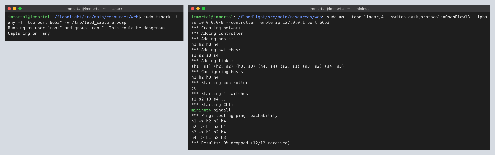
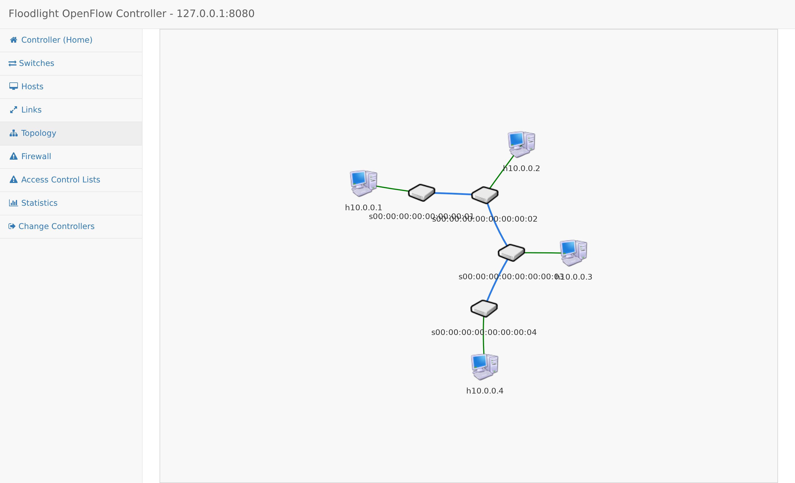
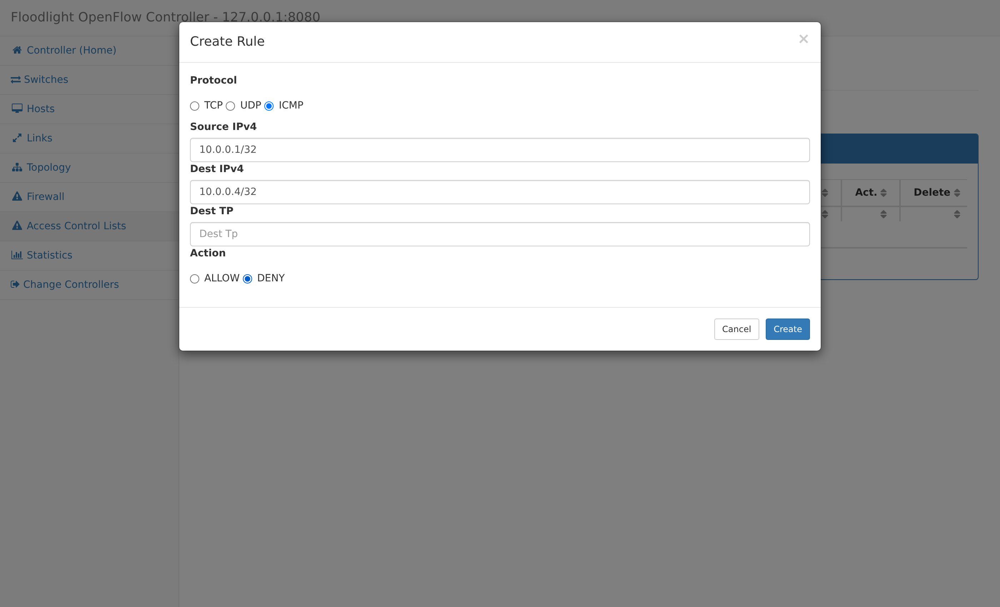
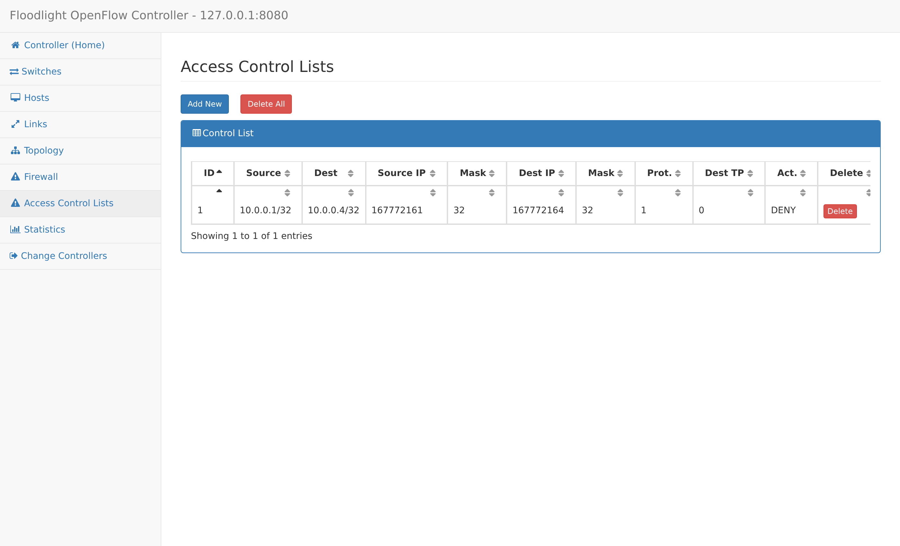
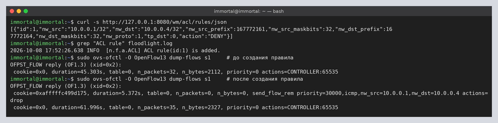
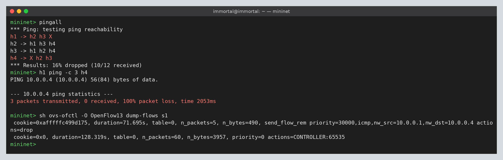
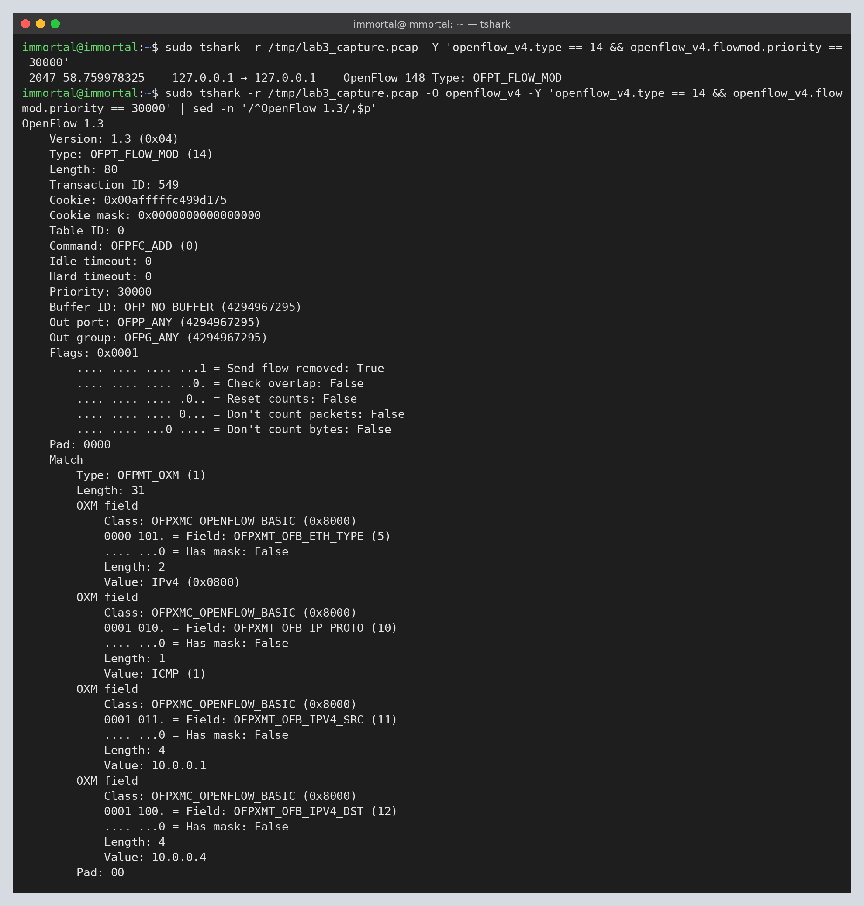
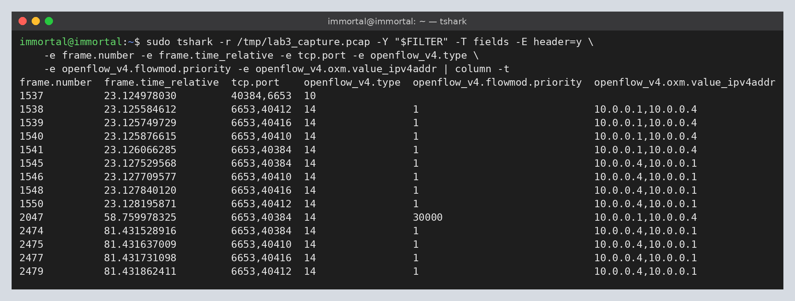

# Lab 3

**Создание правил обработки потока на контроллере SDN**

Цель работы: научиться создавать правила обработки различных потоков трафика с
помощью контроллера SDN (Floodlight, модуль Access Control List).

## Commands

```
# 1. захват OpenFlow-трафика со всех интерфейсов
sudo tshark -i any -f "tcp port 6653" -w /tmp/lab3_capture.pcap

# 2. контроллер Floodlight
cd ~/floodlight && java -jar target/floodlight.jar

# 3. линейная топология из 4 коммутаторов, OpenFlow 1.3
sudo mn --topo linear,4 --switch ovsk,protocols=OpenFlow13 --ipbase=10.0.0.0/8 --controller=remote,ip=127.0.0.1,port=6653

# 4. проверка связности
mininet> pingall

# 5. web UI -> Access Control Lists -> Add New
#    ICMP, 10.0.0.1/32 -> 10.0.0.4/32, DENY
#    (то же самое через REST:)
curl -X POST -d '{"src-ip":"10.0.0.1/32","dst-ip":"10.0.0.4/32","nw-proto":"ICMP","action":"DENY"}' http://127.0.0.1:8080/wm/acl/rules/json

# 6. повторная проверка
mininet> pingall
mininet> h1 ping -c 3 h4
mininet> sh ovs-ofctl -O OpenFlow13 dump-flows s1

# 7. анализ захвата
sudo tshark -r /tmp/lab3_capture.pcap -Y "openflow_v4"
sudo tshark -r /tmp/lab3_capture.pcap -O openflow_v4 -Y 'openflow_v4.type == 14 && openflow_v4.flowmod.priority == 30000'
```

## Run

**Запуск захвата трафика, Mininet и первый pingall**

Все 12 пар хостов доступны: `0% dropped (12/12 received)`.



**Топология в веб-интерфейсе Floodlight**

Контроллер видит 4 коммутатора (s1–s4), соединённых линейно, и 4 хоста
10.0.0.1–10.0.0.4.



**Создание правила ACL (Access Control Lists -> Add New)**

Параметры: протокол – ICMP; исходящий адрес – 10.0.0.1/32; адрес назначения –
10.0.0.4/32; действие – DENY.





**Правило в контроллере и в таблице потоков коммутатора s1**

Сразу после создания правила Floodlight (модуль ACL) проактивно устанавливает на
пограничный коммутатор хоста h1 (s1) запись с приоритетом 30000 и пустым списком
действий (`actions=drop`).



```
immortal@immortal:~$ sudo ovs-ofctl -O OpenFlow13 dump-flows s1     # до создания правила
OFPST_FLOW reply (OF1.3) (xid=0x2):
 cookie=0x0, duration=45.303s, table=0, n_packets=32, n_bytes=2112, priority=0 actions=CONTROLLER:65535
immortal@immortal:~$ sudo ovs-ofctl -O OpenFlow13 dump-flows s1     # после создания правила
OFPST_FLOW reply (OF1.3) (xid=0x2):
 cookie=0xafffffc499d175, duration=5.372s, table=0, n_packets=0, n_bytes=0, send_flow_rem priority=30000,icmp,nw_src=10.0.0.1,nw_dst=10.0.0.4 actions=drop
 cookie=0x0, duration=61.996s, table=0, n_packets=35, n_bytes=2327, priority=0 actions=CONTROLLER:65535
```

**Повторный pingall**



```
mininet> pingall
*** Ping: testing ping reachability
h1 -> h2 h3 X
h2 -> h1 h3 h4
h3 -> h1 h2 h4
h4 -> X h2 h3
*** Results: 16% dropped (10/12 received)
mininet> h1 ping -c 3 h4
PING 10.0.0.4 (10.0.0.4) 56(84) bytes of data.

--- 10.0.0.4 ping statistics ---
3 packets transmitted, 0 received, 100% packet loss, time 2053ms

mininet> sh ovs-ofctl -O OpenFlow13 dump-flows s1
 cookie=0xafffffc499d175, duration=71.695s, table=0, n_packets=5, n_bytes=490, send_flow_rem priority=30000,icmp,nw_src=10.0.0.1,nw_dst=10.0.0.4 actions=drop
 cookie=0x0, duration=128.319s, table=0, n_packets=60, n_bytes=3957, priority=0 actions=CONTROLLER:65535
```

**Сообщение OFPT_FLOW_MOD, которым контроллер установил правило ACL**



```
 2047 58.759978325    127.0.0.1 → 127.0.0.1    OpenFlow 148 Type: OFPT_FLOW_MOD

OpenFlow 1.3
    Version: 1.3 (0x04)
    Type: OFPT_FLOW_MOD (14)
    Command: OFPFC_ADD (0)
    Idle timeout: 0
    Hard timeout: 0
    Priority: 30000
    Flags: 0x0001 (Send flow removed: True)
    Match
        OFPXMT_OFB_ETH_TYPE  = IPv4 (0x0800)
        OFPXMT_OFB_IP_PROTO  = ICMP (1)
        OFPXMT_OFB_IPV4_SRC  = 10.0.0.1
        OFPXMT_OFB_IPV4_DST  = 10.0.0.4
    (инструкций / действий нет -> пакет отбрасывается)
```

**OpenFlow-сообщения для потока h1 <-> h4 до и после правила**

Фильтр: PACKET_IN с ICMP 10.0.0.1 -> 10.0.0.4 и все FLOW_MOD, в match которых
есть пара адресов 10.0.0.1/10.0.0.4. TCP-порт со стороны коммутатора определяет
коммутатор (по FEATURES_REPLY): 40384 – s1, 40410 – s2, 40416 – s3, 40412 – s4.

```
FILTER='(openflow_v4.type == 10 || openflow_v4.type == 14) && ((icmp && ip.src == 10.0.0.1 && ip.dst == 10.0.0.4) || (openflow_v4.oxm.value_ipv4addr == 10.0.0.1 && openflow_v4.oxm.value_ipv4addr == 10.0.0.4))'
```



```
frame.number  frame.time_relative  tcp.port    openflow_v4.type  openflow_v4.flowmod.priority  openflow_v4.oxm.value_ipv4addr
1537          23.124978030         40384,6653  10
1538          23.125584612         6653,40412  14                1                             10.0.0.1,10.0.0.4
1539          23.125749729         6653,40416  14                1                             10.0.0.1,10.0.0.4
1540          23.125876615         6653,40410  14                1                             10.0.0.1,10.0.0.4
1541          23.126066285         6653,40384  14                1                             10.0.0.1,10.0.0.4
1545          23.127529568         6653,40384  14                1                             10.0.0.4,10.0.0.1
1546          23.127709577         6653,40410  14                1                             10.0.0.4,10.0.0.1
1548          23.127840120         6653,40416  14                1                             10.0.0.4,10.0.0.1
1550          23.128195871         6653,40412  14                1                             10.0.0.4,10.0.0.1
2047          58.759978325         6653,40384  14                30000                         10.0.0.1,10.0.0.4
2474          81.431528916         6653,40384  14                1                             10.0.0.4,10.0.0.1
2475          81.431637009         6653,40410  14                1                             10.0.0.4,10.0.0.1
2477          81.431731098         6653,40416  14                1                             10.0.0.4,10.0.0.1
2479          81.431862411         6653,40412  14                1                             10.0.0.4,10.0.0.1
```

- кадры 1537–1550 – первый pingall: PACKET_IN от s1 и по одному FLOW_MOD на
  каждый из 4 коммутаторов в обе стороны (priority 1, правила Forwarding);
- кадр 2047 – создание правила ACL: один FLOW_MOD на s1 (priority 30000, drop);
- кадры 2474–2479 – второй pingall: для направления h1 -> h4 нет ни PACKET_IN,
  ни FLOW_MOD (пакеты отбрасываются на s1 и до контроллера не доходят); для h4 ->
  h1 правила по-прежнему ставятся на все 4 коммутатора.

## Questions

1. Как изменилась связность между узлами?

```
До создания правила все хосты доступны друг другу: 0% dropped (12/12 received).

После создания правила ICMP 10.0.0.1/32 -> 10.0.0.4/32 DENY пропала ICMP-связность
только между h1 и h4: 16% dropped (10/12 received), h1 -> h4 = X и h4 -> h1 = X;
h1 ping h4 - 100% packet loss. Все остальные пары (h1-h2, h1-h3, h2-*, h3-*) работают.

Правило однонаправленное, но не проходят оба пинга:
 - h1 -> h4: эхо-запрос 10.0.0.1 -> 10.0.0.4 отбрасывается на s1;
 - h4 -> h1: запрос 10.0.0.4 -> 10.0.0.1 доходит до h1, но эхо-ответ
   10.0.0.1 -> 10.0.0.4 попадает под то же правило и отбрасывается на s1.
Правило касается только ICMP, остальной трафик (TCP/UDP) между h1 и h4 не блокируется.
```

2. Как изменился обмен сообщениями OpenFlow?

```
1) В момент создания правила контроллер, без какого-либо PACKET_IN, сам отправил
   коммутатору s1 (пограничному для 10.0.0.1) одно сообщение OFPT_FLOW_MOD:
   command=OFPFC_ADD, priority=30000, idle/hard timeout=0 (постоянное),
   match: eth_type=IPv4, ip_proto=ICMP, ipv4_src=10.0.0.1, ipv4_dst=10.0.0.4,
   без инструкций/действий -> пакеты отбрасываются (в ovs-ofctl: actions=drop).
   Приоритет 30000 выше, чем у правил Forwarding (1) и table-miss (0).

2) Для заблокированного направления 10.0.0.1 -> 10.0.0.4 обмен с контроллером
   прекратился: пакеты совпадают с drop-записью на s1 и не вызывают
   OFPT_PACKET_IN, поэтому контроллер не отвечает ни OFPT_PACKET_OUT, ни
   OFPT_FLOW_MOD (до правила на этот поток приходились 1 PACKET_IN, 1 PACKET_OUT
   и 4 FLOW_MOD - по одному на s1..s4; после - 0). Счётчик drop-записи на s1
   растёт (n_packets=5: 2 пакета от pingall и 3 от h1 ping -c 3 h4).

3) Для обратного направления 10.0.0.4 -> 10.0.0.1 и для всех остальных пар
   хостов обмен не изменился: PACKET_IN -> FLOW_MOD на каждый коммутатор пути
   -> PACKET_OUT, плюс периодические ECHO_REQUEST/ECHO_REPLY.
```
