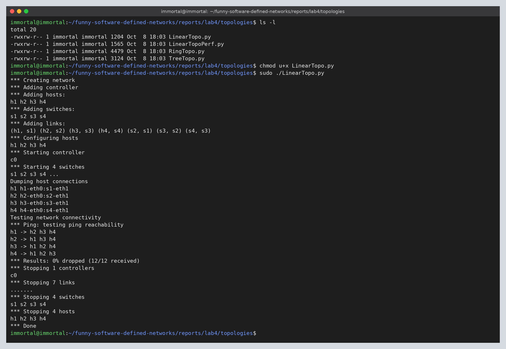
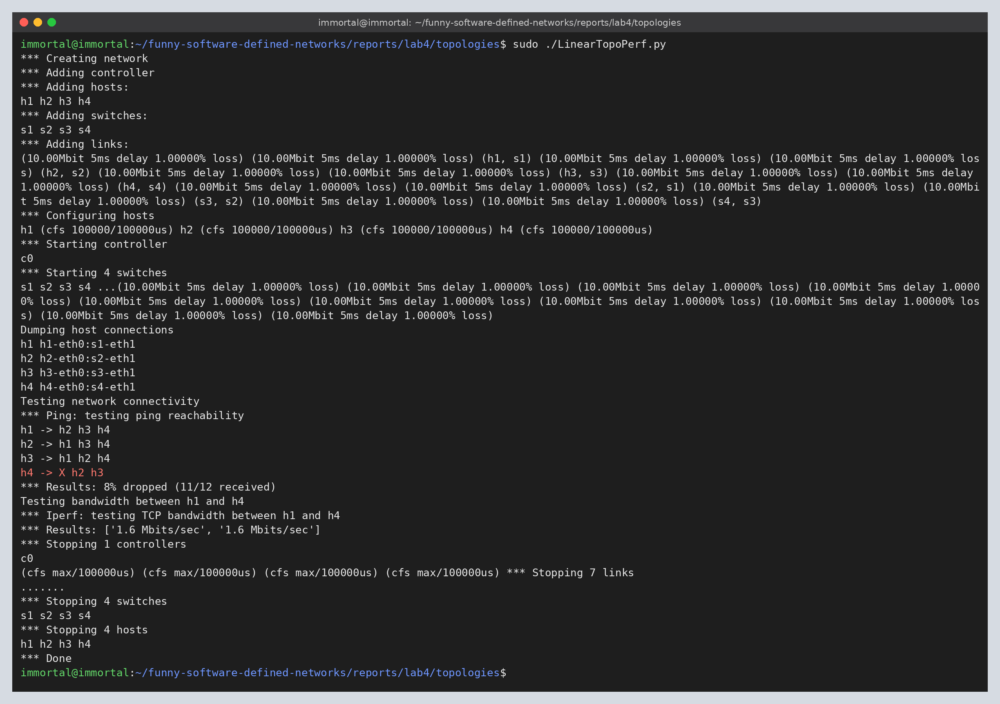
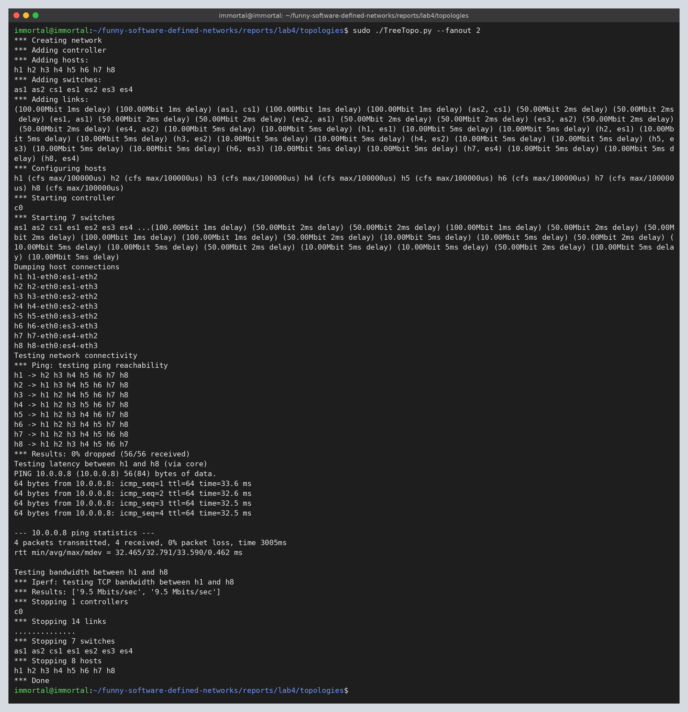
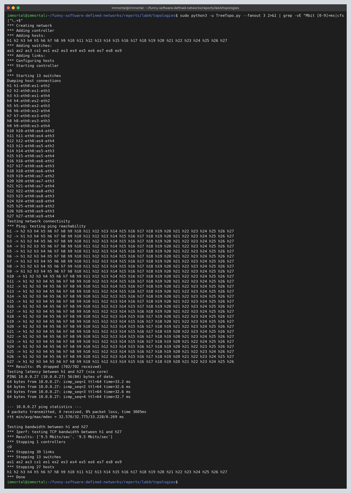
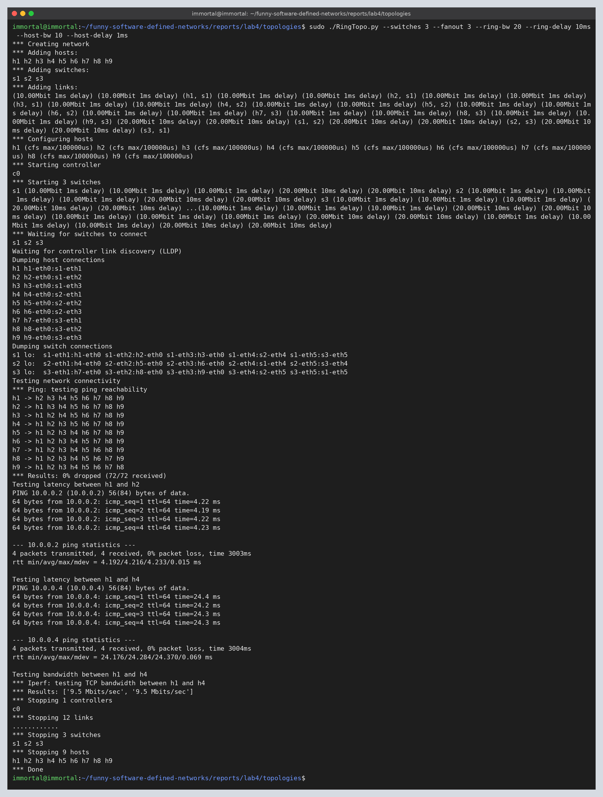
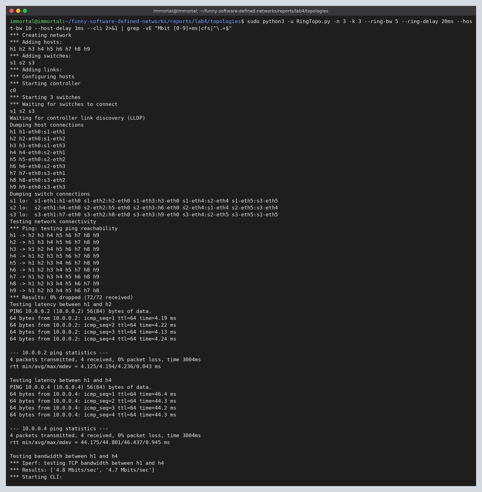
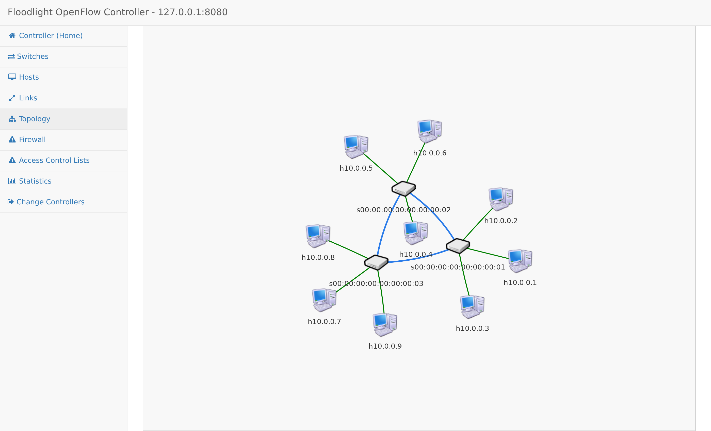
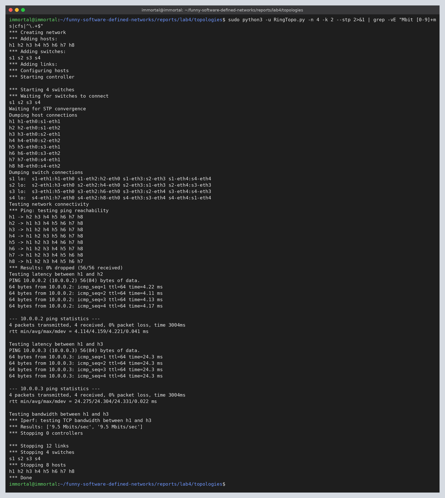

# Lab 4

**Создание топологий в Mininet**

Цель работы: научиться создавать пользовательские топологии с помощью Mininet
Python API, настраивать параметры каналов (пропускная способность, задержка,
потери, размер очереди) и проверять производительность топологий с помощью
`ping` и `iperf`.

Скрипты (Python 3, Mininet 2.3.0):

- [LinearTopo.py](./topologies/LinearTopo.py) – линейная топология из
  методички;
- [LinearTopoPerf.py](./topologies/LinearTopoPerf.py) – та же топология с
  `CPULimitedHost` и `TCLink` (10 Мбит/с, 5 мс, 1% потерь, очередь 1000);
- [TreeTopo.py](./topologies/TreeTopo.py) – задание 1, дерево core /
  aggregation / edge / host с fanout `k`;
- [RingTopo.py](./topologies/RingTopo.py) – задание 2, кольцо коммутаторов с
  fanout `k` и параметрами `bw`/`delay` для каждого соединения.

## Commands

```
cd reports/lab4/topologies

# линейная топология
chmod u+x LinearTopo.py
sudo ./LinearTopo.py

# линейная топология с ограничениями производительности
sudo ./LinearTopoPerf.py

# задание 1: дерево, k = 2 и k = 3
sudo ./TreeTopo.py --fanout 2
sudo python3 -u TreeTopo.py --fanout 3 2>&1 | grep -vE "Mbit [0-9]+ms|cfs|^\.+$"

# задание 2: кольцо (Floodlight запущен: java -jar ~/floodlight/target/floodlight.jar)
sudo ./RingTopo.py --switches 3 --fanout 3 --ring-bw 20 --ring-delay 10ms --host-bw 10 --host-delay 1ms
sudo python3 -u RingTopo.py -n 3 -k 3 --ring-bw 5 --ring-delay 20ms --host-bw 10 --host-delay 1ms --cli 2>&1 | grep -vE "Mbit [0-9]+ms|cfs|^\.+$"

# задание 2: кольцо без контроллера (OVS standalone + STP)
sudo python3 -u RingTopo.py -n 4 -k 2 --stp 2>&1 | grep -vE "Mbit [0-9]+ms|cfs|^\.+$"
```

`grep -v` нужен только для того, чтобы вывод поместился на экран: он убирает
строки с параметрами каждого звена (`(10.00Mbit 5ms delay)`) и лимитами CPU.

## Linear topology

```python
class LinearTopo(Topo):
    "Linear topology of k switches, with one host per switch."

    def __init__(self, k=2, **opts):
        super(LinearTopo, self).__init__(**opts)
        self.k = k
        lastSwitch = None
        for i in irange(1, k):
            host = self.addHost('h%s' % i)
            switch = self.addSwitch('s%s' % i)
            self.addLink(host, switch)
            if lastSwitch:
                self.addLink(switch, lastSwitch)
            lastSwitch = switch
```

Код из методички переведён на Python 3 (`print(...)`), в остальном не изменён.
Контроллер по умолчанию – `c0` (reference controller Mininet).



```
Dumping host connections
h1 h1-eth0:s1-eth1
h2 h2-eth0:s2-eth1
h3 h3-eth0:s3-eth1
h4 h4-eth0:s4-eth1
Testing network connectivity
*** Ping: testing ping reachability
h1 -> h2 h3 h4
h2 -> h1 h3 h4
h3 -> h1 h2 h4
h4 -> h1 h2 h3
*** Results: 0% dropped (12/12 received)
```

**Настройка параметров производительности**

```python
# 10 Mbps, 5ms delay, 1% loss, 1000 packet queue
linkopts = dict(bw=10, delay='5ms', loss=1, max_queue_size=1000, use_htb=True)
...
host = self.addHost('h%s' % i, cpu=.5 / k)
self.addLink(host, switch, **linkopts)
...
net = Mininet(topo=topo, host=CPULimitedHost, link=TCLink)
```



```
*** Ping: testing ping reachability
h1 -> h2 h3 h4
h2 -> h1 h3 h4
h3 -> h1 h2 h4
h4 -> X h2 h3
*** Results: 8% dropped (11/12 received)
Testing bandwidth between h1 and h4
*** Iperf: testing TCP bandwidth between h1 and h4
*** Results: ['1.6 Mbits/sec', '1.6 Mbits/sec']
```

На каждом звене теперь 1% потерь, а путь h4 -> h1 проходит 4 звена в каждую
сторону (h4-s4-s3-s2-s1-h1), поэтому один эхо-запрос `pingall` был потерян. По
той же причине TCP между h1 и h4 даёт 1.6 Мбит/с вместо 10: при потерях около 4%
в каждую сторону и RTT около 40 мс TCP постоянно уменьшает окно перегрузки.

## Task 1. Tree topology

Каждый уровень состоит из одного слоя узлов, у каждого коммутатора `k` потомков:
1 core-коммутатор -> `k` aggregation -> `k^2` edge -> `k^3` хостов. Параметры
каналов задаются отдельно для каждого уровня (`linkopts1/2/3`), пропускная
способность уменьшается от ядра к хостам: core-aggregation – 100 Мбит/с, 1 мс;
aggregation-edge – 50 Мбит/с, 2 мс; edge-host – 10 Мбит/с, 5 мс.

```python
class CustomTopo(Topo):
    "Simple data center topology: core, aggregation, edge and host levels with fanout k."

    def __init__(self, linkopts1=None, linkopts2=None, linkopts3=None, fanout=2, **opts):
        super(CustomTopo, self).__init__(**opts)
        ...
        core = self.addSwitch('cs1', dpid='%x' % 0x100)

        a = e = h = 0
        for _ in irange(1, fanout):
            a += 1
            agg = self.addSwitch('as%s' % a, dpid='%x' % (0x200 + a))
            self.addLink(agg, core, **linkopts1)
            for _ in irange(1, fanout):
                e += 1
                edge = self.addSwitch('es%s' % e, dpid='%x' % (0x300 + e))
                self.addLink(edge, agg, **linkopts2)
                for _ in irange(1, fanout):
                    h += 1
                    host = self.addHost('h%s' % h)
                    self.addLink(host, edge, **linkopts3)
```

Mininet вычисляет DPID коммутатора по цифрам в его имени, поэтому у `cs1`,
`as1` и `es1` он совпал бы. Чтобы этого не было, DPID задан явно: 0x1xx для
core, 0x2xx для aggregation, 0x3xx для edge.

**k = 2** – 7 коммутаторов, 8 хостов, как на рисунке в методичке:



```
*** Adding hosts:
h1 h2 h3 h4 h5 h6 h7 h8
*** Adding switches:
as1 as2 cs1 es1 es2 es3 es4
...
*** Results: 0% dropped (56/56 received)
Testing latency between h1 and h8 (via core)
rtt min/avg/max/mdev = 32.465/32.791/33.590/0.462 ms
Testing bandwidth between h1 and h8
*** Results: ['9.5 Mbits/sec', '9.5 Mbits/sec']
```

**k = 3** – 13 коммутаторов, 27 хостов:



```
*** Adding switches:
as1 as2 as3 cs1 es1 es2 es3 es4 es5 es6 es7 es8 es9
...
*** Results: 0% dropped (702/702 received)
Testing latency between h1 and h27 (via core)
rtt min/avg/max/mdev = 32.570/32.775/33.228/0.269 ms
*** Results: ['9.5 Mbits/sec', '9.5 Mbits/sec']
```

Проверка параметров каналов: путь h1 -> h(last) идёт через ядро
(host-edge-aggregation-core-aggregation-edge-host), односторонняя задержка
5+2+1+1+2+5 = 16 мс, ожидаемый RTT – 32 мс, измеренный – 32.8 мс. Пропускная
способность ограничена самым узким звеном (edge-host, 10 Мбит/с), iperf
показывает 9.5 Мбит/с.

## Task 2. Ring topology

`n` коммутаторов соединены в кольцо s1-s2-...-sn-s1, к каждому подключено `k`
хостов (fanout). Параметры `bw` и `delay` задаются отдельно для звеньев кольца
(`--ring-bw`, `--ring-delay`) и для звеньев доступа (`--host-bw`,
`--host-delay`).

```python
class RingTopo(Topo):
    "Ring of n switches, k hosts per switch."

    def __init__(self, n=3, k=3, ringopts=None, hostopts=None, **opts):
        super(RingTopo, self).__init__(**opts)
        ...
        switches = [self.addSwitch('s%s' % i) for i in irange(1, n)]

        h = 0
        for switch in switches:
            for _ in irange(1, k):
                h += 1
                host = self.addHost('h%s' % h)
                self.addLink(host, switch, **hostopts)

        for i in range(n):
            # s1-s2, s2-s3, ..., sn-s1: last link closes the ring
            if n > 2 or i < n - 1:
                self.addLink(switches[i], switches[(i + 1) % n], **ringopts)
```

В кольце есть петля. С обычным контроллером, который ведёт себя как
learning-switch, широковещательные ARP-запросы ходили бы по кольцу бесконечно
(broadcast storm). Поэтому скрипт поддерживает два режима:

- по умолчанию коммутаторы (OpenFlow 1.3) подключаются к Floodlight
  (`RemoteController`, 127.0.0.1:6653). Floodlight находит связи между
  коммутаторами через LLDP и рассылает broadcast только по остовному дереву.
  Скрипт ждёт 20 с после старта, пока контроллер обнаружит все связи;
- `--stp` – без контроллера: OVS в режиме `standalone` с включённым STP, который
  блокирует один из портов кольца.

**Кольцо 3 x 3, кольцо 20 Мбит/с / 10 мс, хосты 10 Мбит/с / 1 мс**



```
Dumping switch connections
s1 lo:  s1-eth1:h1-eth0 s1-eth2:h2-eth0 s1-eth3:h3-eth0 s1-eth4:s2-eth4 s1-eth5:s3-eth5
s2 lo:  s2-eth1:h4-eth0 s2-eth2:h5-eth0 s2-eth3:h6-eth0 s2-eth4:s1-eth4 s2-eth5:s3-eth4
s3 lo:  s3-eth1:h7-eth0 s3-eth2:h8-eth0 s3-eth3:h9-eth0 s3-eth4:s2-eth5 s3-eth5:s1-eth5
*** Results: 0% dropped (72/72 received)
Testing latency between h1 and h2
rtt min/avg/max/mdev = 4.192/4.216/4.233/0.015 ms
Testing latency between h1 and h4
rtt min/avg/max/mdev = 24.176/24.284/24.370/0.069 ms
*** Results: ['9.5 Mbits/sec', '9.5 Mbits/sec']
```

**Кольцо 3 x 3, кольцо 5 Мбит/с / 20 мс, хосты 10 Мбит/с / 1 мс**



```
*** Results: 0% dropped (72/72 received)
Testing latency between h1 and h2
rtt min/avg/max/mdev = 4.125/4.194/4.236/0.043 ms
Testing latency between h1 and h4
rtt min/avg/max/mdev = 44.175/44.801/46.437/0.945 ms
*** Results: ['4.8 Mbits/sec', '4.7 Mbits/sec']
```

**Топология кольца в веб-интерфейсе Floodlight** (3 коммутатора в кольце, по 3
хоста на каждом)



**Кольцо 4 x 2 без контроллера (`--stp`)**



```
Waiting for STP convergence
*** Results: 0% dropped (56/56 received)
rtt min/avg/max/mdev = 4.114/4.159/4.221/0.041 ms
rtt min/avg/max/mdev = 24.275/24.304/24.331/0.022 ms
*** Results: ['9.5 Mbits/sec', '9.5 Mbits/sec']
```

Проверка параметров каналов:

| Конфигурация            | Пара    | Путь                         | Ожидаемый RTT        | Измеренный RTT | iperf         |
| ----------------------- | ------- | ---------------------------- | -------------------- | -------------- | ------------- |
| кольцо 20 Мбит/с, 10 мс | h1 - h2 | h1-s1-h2                     | 2 x (1+1) = 4 мс     | 4.2 мс         | –             |
| кольцо 20 Мбит/с, 10 мс | h1 - h4 | h1-s1-s2-h4                  | 2 x (1+10+1) = 24 мс | 24.3 мс        | 9.5 Мбит/с    |
| кольцо 5 Мбит/с, 20 мс  | h1 - h4 | h1-s1-s2-h4                  | 2 x (1+20+1) = 44 мс | 44.3 мс        | 4.8 Мбит/с    |

В первом случае самое узкое звено – звено хоста (10 Мбит/с), во втором –
звено кольца (5 Мбит/с). Задержка и пропускная способность совпадают с
заданными параметрами, то есть `bw` и `delay` применяются к каждому соединению.

## Notes

- В Mininet 2.3 контроллер по умолчанию и `TCLink` работают без доработок; для
  Python 3 в коде из методички заменён только `print`.
- Floodlight 1.2 не разбирает некоторые сообщения OVS 2.17 с расширенными
  полями Nicira (`OFParseError: Unknown value for discriminator typeLen of class
  OFOxmVer13: 82436`), и коммутаторы переподключаются. Если запустить новую сеть
  на том же экземпляре Floodlight, у него остаётся устаревшее состояние, и
  часть хостов оказывается недоступна. Поэтому перед каждым запуском кольца
  контроллер перезапускался, а скрипт ждёт обнаружения связей через LLDP.
